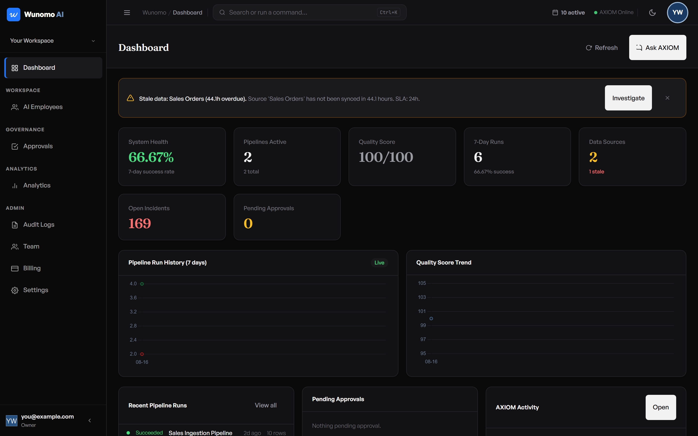

# AXIOM Self-Test Guide — Try The Whole Product Yourself

This assumes you've never clicked through this product end to end, and
specifically that you've **never used the Tasks feature** — every click,
every field, every button label is spelled out exactly as it appears on
screen. If a step says "click **+ New Pipeline**," that's the literal text
you're looking for.

Work through the sections in order: **1. Pre-flight** gets everything
running, **2. Setup** gets one real file of data into the product, **3. The
full flow** is the main walkthrough (source → pipeline → quality rule →
the Tasks feature, start to finish), **4. What to try breaking** is a short
list of things worth deliberately doing wrong, and **5. LLM budget** tells
you what each part actually costs so you don't run out of AI calls halfway
through.

**Sections 6–14 are a later addition** (screens that had zero coverage
before) — do **6 (Dashboard)** right after your first login, before
Section 2; do **7–11** (Incidents, Transforms, Settings, Approvals,
Governance) whenever you like, ideally after you finish Section 3's Tasks
walkthrough since a couple of asides in Section 3 point forward to them;
**12** is a 5-minute sweep of the app chrome (sidebar, topbar, command
palette); **13 and 14 are reference, not steps** — read them, don't click
through them. Honestly, all of it together runs well past 90 minutes
(more like 2–2.5 hours) — if you're short on time, see the "fast path"
note at the top of Section 13.

**Section 15 (Wunomo Projects) is a later addition too, appended after 13/14
rather than inserted before them** — that keeps every existing cross-reference
in this document (`§13`, `§14`, "item N") pointing at what it always pointed
at, instead of a wholesale renumbering. Treat it as continuing the real
walkthrough, not as more reference material like 13/14 — it needs **Sections
1–3 done first** (it hires agents into a project and reuses "Sales Ingestion
Pipeline"/"Sales Orders"). It covers named agents, channels, real @mentions,
a task that succeeds, a scope denial that can't be undone by the fix that
caused it, a source-lock race between two agents, a rejected file type, a
budget wall, offboarding, and a real scheduled run — the part of the product
this guide had zero coverage of until now.

---

## 1. PRE-FLIGHT — start everything and confirm it's healthy

### 1.1 Start Docker

Open a terminal (PowerShell — click the Windows Start button, type
`powershell`, press Enter) and run:

```
cd "C:\Pratyaksh Personal\My Projects\ai workforce\dataops-agent"
docker compose ps
```

**What you should see:** a table listing 5 rows — `dataops_backend`,
`dataops_beat`, `dataops_celery`, `dataops_postgres`, `dataops_redis` —
each with a `STATUS` column saying **`Up ...`**.

**If the table is empty, or any row doesn't say `Up`:**
```
docker compose up -d
```
Wait about 15 seconds, then run `docker compose ps` again and confirm all
5 rows say `Up`.

### 1.2 Confirm the backend is actually healthy (not just "the container started")

A container can say `Up` while the app inside it is still crashing. Check
the real thing:

```
curl http://localhost:8000/health
```
**Good result:** `{"status":"ok","env":"development","version":"1.0.0"}`

```
curl http://localhost:8000/health/db
```
**Good result:** `{"status":"ok","db":"connected"}`

**If either one fails to connect at all:** the backend container isn't
actually up yet — wait 10 more seconds and try again. **If `/health/db`
returns an error body** (not a connection failure, an actual error
message): Postgres isn't reachable — run `docker compose ps` again and
confirm `dataops_postgres` says `Up`.

### 1.3 Start the frontend

The frontend is *not* one of the Docker containers — you run it yourself,
in its own terminal window that has to stay open:

```
cd "C:\Pratyaksh Personal\My Projects\ai workforce\dataops-agent\frontend"
npm run dev
```

**What you should see:** after a few seconds, a line saying `Ready in
...ms`, and the window stays open (don't close it — closing it stops the
site). Leave this terminal running for your whole session.

Now open a browser and go to **http://localhost:3000**. You should land on
a login page. If the browser can't connect at all, the frontend isn't
actually up yet — check the terminal for a red error instead of `Ready`.

### 1.4 Which login to use

You have two options. **For this guide, use option A** — it gives you a
completely clean, empty account you fully control, which is what the rest
of this guide assumes.

**Option A — Sign up fresh (recommended for this guide).** On the login
page, click **Sign up** (a link near the bottom of the form). You'll fill
in your own email/password in step 3.1 below — don't do it yet, just
confirm the page loads.

**Option B — Use the pre-built demo account**, if you just want to look
around without setting anything up yourself:
- Email: `demo@axiom-yc.ai`
- Password: `AxiomDemo2026!`

This account already has a real source, a real pipeline with real run
history, and one real open incident — but it has **no Tasks data**, since
the Tasks feature didn't exist when this demo account was built. If you
use this login, you can skip straight to the Tasks part of Section 3
(3.9 onward), since the source/pipeline/quality-rule setup is already
done for you.

### 1.5 How to reset the demo account back to its known-good state

If you (or anyone else) has been clicking around in the demo account and
you want it back to exactly its original state:

```
cd "C:\Pratyaksh Personal\My Projects\ai workforce"
node dataops-agent/scripts/demo_reset.mjs
```

This takes 15–30 seconds and is safe to re-run any number of times — it
always rebuilds the same fixed state (one healthy pipeline, one broken
pipeline with one real open incident about it). It does **not** touch
your own fresh-signup account from Option A — that's a separate,
independent tenant. If you want to start *your own* account over, the
simplest way is just to sign up again with a new email — every signup
creates a brand new, empty account with nothing shared between accounts.

### 1.6 Check your AI quota before you spend any of it

This product uses two real AI providers (Google Gemini and Groq/Llama).
Both have a real daily limit, and this project's Gemini key is capped at
roughly **20 real requests per day** — not a lot. Section 5 below has the
full cost breakdown; this step is just about checking where you stand
*before* you start.

**Free check (costs nothing, just looks at what's already happened
today):**
```
docker exec dataops_postgres psql -U dataops_user -d dataops -c "SELECT provider, count(*) AS calls_today FROM llm_usage_events WHERE created_at >= CURRENT_DATE GROUP BY provider;"
```
This shows how many real AI calls have already happened today, split by
provider. If you see `gemini` already sitting near 20, expect it to fall
back to the other provider (Groq) automatically — the product handles
that on its own, you don't need to do anything.

**Optional live probe (costs exactly 1 real call, confirms the AI is
actually responding right now, not just that quota exists):**
```
node "C:\Pratyaksh Personal\My Projects\ai workforce\dataops-agent\scripts\demo_chat_test.mjs" "Say OK."
```
**Good result:** a line saying `status: 200`, a `provider:` name, and a
real reply from AXIOM within about 10 seconds. **Bad result:** `status:
500`, or it hangs for 30+ seconds. That means both providers are
temporarily unavailable — wait 15 minutes and try again; it's not
something you broke.

### 1.7 A closer look at the login screen

You've already glanced at this page in 1.3/1.4 — this is the full tour of
every control on it, field labels exactly as they appear in the code, not
paraphrased. You don't need to click through all of this now if you're
about to sign up (3.1) or use the demo login (1.4B) — this is here so you
know what every button on this screen actually does when you come back to
it later (e.g. logging back in, or logging in as the Viewer in §4.4).

**The default view (password login):**
- Input **Email**
- Input **Password**
- Button **Log in**
- Link-button **Email me a code instead** — switches to a passwordless
  flow: an **Email** field and a **Send code** button; after sending, a
  **Code** field (6 digits) and **Verify & log in** button, with
  **Resend code** (becomes **Resend in 60s** immediately after sending,
  counting down) and **Back to password**.
- Below the form: a divider reading **or**, then button **Continue with
  Google** — this genuinely redirects to Google's real OAuth consent
  screen; only follow it if you actually have a Google account you want
  to test with, this guide doesn't walk through that flow further.
- Footer: **Don't have a workspace? Sign up**

**If the email you log in with is linked to more than one workspace**
(this can happen if you signed up twice with the same email — see the
signup nudge below): a modal titled **Choose a workspace** appears, body
text *"This email is linked to more than one workspace. Pick which one to
continue into."*, with one clickable card per workspace showing its name.
**As of 2026-08-19 (item 1), this only appears the first time** — whichever
workspace you pick (or the one you're already in, for a single-workspace
login) is remembered server-side, so your next login on any device skips
straight to it. You'll only see this picker again if you deliberately
switch workspaces via the sidebar (§12) and it becomes the new
remembered one, or if the remembered workspace stops being valid for you
(removed, deactivated) and more than one other option remains.

**Worth knowing, not something to test directly:** if you land back here
with a URL ending in `?expired=1` (your session token aged out — JWTs on
this app last 60 minutes), you'll see a toast: *"Session expired — please
log in again."*

**On the signup side** (`Sign up` link, or directly typing your details in
§3.1): if you register with an email that already has a workspace, you
aren't blocked — a banner appears: *"Heads up — this email already has a
workspace (or N workspaces) (names…). Your new workspace was still
created."* with a button **Continue to your new workspace** and a link
**Log in to an existing workspace instead**. Worth trying once if you ever
sign up a second time in this guide (e.g. testing the Team invite flow's
own account creation) — otherwise not essential.

---

## 2. SETUP — get one real file of data into the product

### 2.1 The sample file

Save this as `sales_data.csv` anywhere on your computer (Desktop is fine —
you'll pick it from a file browser in a moment). This exact file already
exists at the root of this project too, at
`C:\Pratyaksh Personal\My Projects\ai workforce\sales_data.csv`, so you
can use that one directly instead of retyping it if you'd rather.

```csv
order_id,customer_name,product,quantity,price,date,status
1001,Rahul Sharma,Laptop,2,45000,2024-01-15,completed
1002,Priya Singh,Mouse,5,800,2024-01-16,completed
1003,Amit Kumar,Keyboard,3,1500,2024-01-16,pending
1004,Sneha Patel,Monitor,1,12000,2024-01-17,completed
1005,Raj Verma,Laptop,1,45000,2024-01-17,cancelled
1006,Deepa Nair,Headphones,4,2500,2024-01-18,completed
1007,Vikram Joshi,Mouse,2,800,2024-01-18,pending
1008,,Keyboard,1,1500,2024-01-19,completed
1009,Anita Desai,Monitor,2,12000,2024-01-19,completed
1010,Karan Mehta,Laptop,1,45000,2024-01-20,completed
```

Notice row `1008` has a **blank customer name** — that's deliberate. You'll
use it later to see a quality check genuinely catch something real,
instead of a check that just always passes and proves nothing.

### 2.2 Upload it as a Data Source

*(As of 2026-08-19: Data Sources, Data Catalog, Pipelines, Transforms,
Quality, Incidents, Governance, Automations, and CI/CD all live inside
**AXIOM's own sidebar domain** now, not the default Workspace sidebar you
land on after login — the same domain Chat and Tasks already used. To get
there: click **AI Employees** in the sidebar, then click into **AXIOM**'s
card (or just navigate to any of those screens directly — the first click
into one of them swaps the sidebar automatically). A **← Back to
Workspace** link appears at the top of the sidebar the whole time you're
in this domain, replacing the **Production** row. Once you're in, all of
the screens above stay in the same sidebar together — you won't need to
repeat this for Pipelines/Quality right after Data Sources. Approvals
stayed in the regular Workspace sidebar — it's not part of this domain.)*

1. Click **AI Employees** in the sidebar, then click into **AXIOM**'s
   card. In the sidebar that appears, click **Data Sources**.
2. Click **+ Add Source** (top right).
3. A window titled **Add Data Source** opens. The **Type** dropdown
   already says **CSV file** — leave it as is.
4. Click the **File** field and pick `sales_data.csv` from your computer.
5. A **Name** field appears, pre-filled with the filename. Clear it and
   type: `Sales Orders`
6. Click **Upload & Create** (bottom right of the window).

**What you should see:** a green success message near the bottom of the
screen, the window closes, and a new row appears in the table: **Sales
Orders**, type `csv`, status **Active**, and a **Last Profiled** column
that says **Never**.

### 2.3 Confirm it actually profiled — this is the step people miss

Uploading a file registers it, but it does **not** automatically read its
column structure — you have to ask it to, once, per source.

1. On the **Sales Orders** row, in the **Actions** column, click the
   Profile icon — a magnifying glass, second icon from the left, tooltip
   **"Profile"** on hover.
2. Wait a couple of seconds.

**What you should see:** a green "Source profiled" message, and the
**Last Profiled** column now shows a real date/time instead of "Never."

**If it looks wrong** (still says "Never" after clicking the Profile icon,
or an error toast appears): click it again — this action is safe to
repeat. If it keeps failing, re-check Section 1.2 (backend health) — a
profile failure almost always means the backend lost its connection to
the uploaded file, which usually means Docker was restarted without the
upload volume attached.

*(Optional double-check: click* **Data Catalog** *in the sidebar — you
should see* **Sales Orders** *listed with 7 real columns:* `order_id`,
`customer_name`, `product`, `quantity`, `price`, `date`, `status`*.)*

### 2.4 Also try on this screen (optional, any time after 2.3)

Two more row actions exist on Data Sources that the walkthrough above
doesn't use. As of 2026-08-19, every table's row actions in this app follow
one rule, worth knowing once here since this is the first table this guide
touches: **frequent, non-destructive actions are icon-only buttons directly
in the row** (hover any of them for a tooltip naming it); **destructive or
irreversible actions live behind a ⋮ (three-dot) overflow button** — the
last icon in the **Actions** column — instead of standing in the row
themselves, specifically so an accidental click can't trigger them in one
motion.

- **Sync** — a refresh icon, first icon in the **Actions** column, tooltip
  **"Sync"** on hover. Re-reads the source's data (for a CSV, effectively a
  no-op refresh since the file doesn't change; this matters more for a
  database source). Click it on the **Sales Orders** row. **What you
  should see:** a "Sync started." toast. No AI cost — this is a plain data
  operation.
- **Delete** — behind the row's ⋮ overflow menu, not its own icon: click
  the ⋮ button, then click **Delete** in the dropdown that opens. **Don't
  do this on Sales Orders** — the rest of this guide depends on it
  existing. If you want to see the delete flow, upload a disposable second
  source first (repeat 2.2 with any small file, or even the same
  `sales_data.csv` under a different name), then delete *that* one.

### 2.5 Your quota headroom for this specific walkthrough

One thing that would normally be worth testing deliberately — what
happens when a tenant's AI-credit quota actually runs out (a real `402`
response, the product's own quota-wall) — **isn't reachable in this
walkthrough, and that's expected, not a gap.** `demo_reset.mjs` (§1.5) sets
the demo tenant's plan to `scale` (500,000 AI credits/month) specifically
so rehearsals don't hit a quota wall. If you're on your own fresh-signup
account instead (§1.4A), you're on whatever the default starter plan's
credit allowance is — still generous enough that this guide's handful of
real AI calls (see Section 5) won't come close to it. Either way: **if you
don't see a 402/quota-exceeded message anywhere in this guide, that's the
scale plan (or a healthy starter allowance) doing its job, not something
missing.**

---

## 3. THE FULL FLOW — one numbered step per click

### Part A — Source → Pipeline → Run

**3.1** *(Skip this if you're using the demo login from 1.4B.)* If you
haven't signed up yet: on the login page, click **Sign up**. Fill in:
- **Full name**: anything, e.g. `Test User`
- **Email**: any email you haven't used before, e.g. `test1@example.com`
- **Workspace name**: anything, e.g. `My Test Company`
- **Password**: anything 8+ characters

Click **Create account**.

**What you should see:** a short 4-step onboarding wizard (pick anything
in each step — role, industry, company size, use cases — none of it
affects this test). Click through it with **Next**, then **Finish** on
the last step. You land on the **Dashboard**.

*(Section 6 below is a full tour of this Dashboard screen — worth doing
right now, before you go further, since you're already looking at it.)*

**3.2** If you already did Section 2 (uploaded Sales Orders), skip ahead
to 3.3. Otherwise, go do Section 2 now, then come back here.

**3.3** In the left sidebar, click **Pipelines**.

**3.4** Click **+ New Pipeline** (top right).

**3.5** In the window that opens:
- **Name**: type `Sales Ingestion Pipeline`
- **Source**: open the dropdown and pick **Sales Orders**
- **Description**: type `Pulls in sales orders` (optional, but type it
  anyway so you can see the field work)
- **Schedule (cron, optional)**: leave blank — you'll run it manually

Click **Create**.

**What you should see:** the window closes, a green success message
appears, and **Sales Ingestion Pipeline** appears in the table with status
**draft** and "Never run" under Next/Last Run.

**3.6** On that row, in the **Actions** column, click the Trigger icon — a
play triangle (▶), first icon in the row, tooltip **"Trigger"** on hover.

**What you should see:** a "Run triggered" message. Within a couple of
seconds (refresh isn't automatic here — click the Trigger icon once and
wait, or click the pipeline's name to check), the row's **Next / Last
Run** column should show **Last: success** in a green badge.

**If it shows a red "failed" badge instead:** click the pipeline's own
**name** (it's a clickable link) — a window titled **Runs — Sales
Ingestion Pipeline** opens showing every run with a real error message.
The most common cause at this stage is the file upload not being visible
to the pipeline worker — re-check that Section 2.3's Profile step
actually succeeded.

**3.7** Click the pipeline's name (**Sales Ingestion Pipeline**) to open
its run history.

**What you should see:** a window listing at least one run, status
**success**, with a real row count (10 — matching the 10 data rows in the
CSV) and a real duration in milliseconds. Close the window (click outside
it or the X).

*Also try on this screen (optional, any time after this step):* each row's
**Actions** column has, in order: the Trigger icon (▶, tooltip
**"Trigger"**); then either a checkmark icon (tooltip **"Activate"**, if
the pipeline is currently `paused`) or a two-bar pause icon (tooltip
**"Pause"**, if it's active); then the ⋮ overflow menu, which opens to
reveal **Delete**. Click the Pause icon — the badge should flip to
`paused` and a "Pipeline paused." toast appears; click the same spot (the
icon and tooltip have swapped to Activate) to flip it back. Don't open
the ⋮ menu and click **Delete** on this pipeline — Part B and Part C both
depend on it.

### Part B — A quality rule that actually catches something

**3.8** In the left sidebar, click **Quality**.

**3.9** Click **+ New Rule**.

**3.10** In the window:
- **Name**: `No missing customer name`
- **Pipeline**: pick **Sales Ingestion Pipeline**
- **Rule type**: leave it on **not_null** (the first option)
- **Column (optional)**: type `customer_name`
- **Severity**: leave on the default

Click **Create**.

**3.11** On the new rule's row, in the **Actions** column, click the Run
Checks icon — a checkmark, tooltip **"Run Checks"** on hover.

**What you should see:** a message like "Checks ran — score ..., X
passed / 1 failed." — the **1 failed** is real: it's catching row 1008's
blank customer name. The **Pass / Fail** column on that row should now
show real numbers, not `0 / 0`.

*(One thing worth knowing: "Run Checks" re-runs* **every** *quality rule
attached to that pipeline, not just the one you clicked it on — if you
add more rules later, all of them run together.)*

*Also try on this screen (optional):* each row also has a **Delete**
button — click it on a disposable rule if you want to see the flow (a
"Rule deleted." toast, and the row disappears). Don't delete **No missing
customer name** if you want to keep re-running it later.

### Part C — The Tasks feature (this is the new part)

This is where AXIOM actually plans and does multi-step work on its own,
with you reviewing and approving each risky step before it happens.
Nothing you've done so far in this guide used AXIOM's AI at all — this is
the first part that spends real AI calls (see Section 5 for exact costs).

**3.12** In the left sidebar, under **WORKSPACE**, click **AI Employees**.

**What you should see:** a grid of AI employee cards — **AXIOM** is the
only one marked **Active**; the rest (LEDGER, DEPLOY, INSIGHT, SENTINEL,
PULSE) are labeled **Coming Soon** and have no button. On the AXIOM card,
click **Open AXIOM →**.

**What you should see now:** you land on the chat screen, and the sidebar
itself changes — the full workspace nav list crossfades out and is
replaced by **AXIOM** (with its **Live** badge), **Tasks**, and (as of
2026-08-19) the full set of DataOps operational screens too: **Data
Sources**, **Data Catalog**, **Pipelines**, **Transforms**, **Quality**,
**Incidents**, **Governance**, **Automations**, and **CI/CD** — this is
the same expanded list §2.2 already had you click into for Data Sources,
if you did Section 2 first. At the top of the sidebar, where
**Production** used to sit, a **← Back to Workspace** link now appears —
that's your way out of AXIOM's domain from anywhere inside it, not just
from this screen. Approvals stays in the regular Workspace sidebar, not
here. (This is a 2026-08 change — AXIOM used to be a direct top-level
sidebar item; it's now nested behind AI Employees like every other AI
employee will be, and as of 2026-08-19 covers the operational screens
above too, not just chat and Tasks.)

**Deleting a conversation (new 2026-08-19, item 4):** in the **Recent**
list on the left of the chat screen, hover any conversation row — a small
**✕** appears on the right. Clicking it deletes that conversation
permanently (no confirmation dialog, matching every other delete in this
app) and the list updates immediately, no reload needed. If that
conversation still has an approval waiting on a decision, you'll get a
toast instead: *"This conversation has an approval waiting on your
decision"* with a **Go to Approvals** link — the conversation is not
deleted in that case. Once the approval is resolved (approved, rejected,
or executed), the same conversation deletes normally.


**3.13** In the top right of the chat panel, click **+ Start a Task**.

**What you should see:** a window titled **Start a Task** opens, with a
text box labeled **"What should AXIOM do?"** and a dropdown labeled
**"Task type."**


**3.14** In the text box, type exactly:
```
Check the health and recent run history of my Sales Ingestion Pipeline.
```

**3.15** Leave the **Task type** dropdown on its default value,
**"Diagnose pipeline failure."**

**3.16** Click **Generate Plan** (bottom right).

**Cost: 1 real AI call** (occasionally 2 — see Section 5 for when and
why; never more than 2).

**What you should see:** the button changes to "Generating plan…" for a
few seconds (this is a real AI call happening) — then a green "Plan
generated — review it before approving" message, and a new card appears
right in the chat: **"Started task: Check the health and recent run
history of my Sales Ingestion Pipeline."** with a **View progress**
button.


**If nothing happens after 30+ seconds, or you see a red error message:**
the AI provider is likely temporarily unavailable — this is the same
"bad result" case from the 1.6 quota check. Wait a few minutes and try
again with the **+ Start a Task** button; nothing was created (check the
**Tasks** page — it should be empty if this happened).

**3.17** Click **View progress** on that card.

**What you should see:** you're taken to a new page. At the top: the goal
you typed as the title, a teal **Draft Plan** badge, and a real
step-by-step plan in a table — showing exactly which tool AXIOM plans to
call and with what arguments (this is real, not a guess — it's what will
actually run if you approve it).


*Your exact plan might have a different number of steps than the
screenshot — that's normal, AXIOM generates it fresh from a real AI call
each time.*

**3.18** Now let's edit a step, to see AXIOM tell the difference between
what it planned and what a human changed. Click **Edit Plan** (top right
of the plan card).

**3.19** The first step's description becomes an editable text box. Click
into it, clear it, and type:
```
Check the pipeline's recent runs (edited by a human reviewer).
```

**What you should see, while still in edit mode:** below the description,
each step also has editable **Tool name** and **Tool args** fields — the
latter a free-text JSON box. You don't need to touch these for this
walkthrough, but it's worth knowing they're there: this box does **not**
validate the JSON as you type — if you type something that isn't valid
JSON, it's silently ignored (your last valid value is kept) with **no
visible error message**. If you want to see this for yourself: click into
a step's tool-args box, type a stray `{` with nothing else, then click
elsewhere — nothing will look wrong, but your edit didn't take. Not a bug
worth reporting; it's on the known-issues list (Section 14).

**3.20** Click **Save Changes**.

**What you should see:** a "Plan updated." message, the task-level badge
row now shows an extra amber **Plan edited** badge, and — the important
part — the step's **Origin** column, which said gray **"AXIOM planned"**
before, now says amber **"Human edited."**


*(If you want to back out of an edit instead of saving it: while in edit
mode, a* **Discard edits** *button sits next to* **Save Changes** *— it
drops whatever you typed and returns to the read-only plan view with
nothing changed.)*

**3.21** Click **Approve Plan** (bottom right of the card).

**What you should see:** the status badge flips from **Draft Plan** to
**Queued**, the Edit/Approve/Reject buttons disappear, and two new
buttons appear at the top right: **Advance one step** and **Run to
completion**.

**3.22** Click **Run to completion**.

**Cost: 0 real AI calls, normally.** The one exception: if a step's tool
call comes back with a real, structured error (e.g. "pipeline not
found"), AXIOM gets **exactly one** extra AI call for *that step* to try
adapting its arguments before giving up — capped at 1 extra call per step
no matter how many of its retries happen. Whether this fires depends on
what AXIOM's plan actually contains, which is why it isn't a guaranteed
cost.

**What you should see:** the button changes to "Running…" and the step
timeline below updates live as each step actually runs. Wait for it to
settle (a few seconds per step). It will land on one of these real, valid
outcomes — **all of these are correct, normal results**, not bugs:

- **Completed** (green badge) — every step succeeded. The step timeline
  shows a green "succeeded" status and a real outcome summary for each
  one.
- **Paused Failed Step** (amber badge) — a step tried something (like
  looking up the pipeline by the exact name AXIOM guessed) and it didn't
  resolve after 3 real attempts. A banner at the top will name the exact
  step and the exact error — read it, it's specific, not generic.

Either way, the **step_budget** counter near the top ("N/20 steps used")
should have gone up from `0/20`, and the top-right topbar's "N active"
counter (next to the calendar icon) should reflect it.


**3.23** Click **← All tasks** (top left) to go back to the list.

**What you should see:** a table with the one task you just ran, showing
its real final status, whether the plan was edited, and when it was
created.


*(Optional — a second way to reach this whole flow: the exact same
"Start a Task" modal is also reachable directly from this Tasks list
page — click* **+ New Task** *at the top right, or, if the list is empty,
the identical button inside the empty state. It's the literal same
component "+ Start a Task" in chat opens; nothing behaves differently
depending on which entry point you used.)*

**Re-run (new 2026-08-19, item 13).** Any task whose status is
**Completed**, **Completed With Unconfirmed Steps**, or **Failed** shows
a **Re-run** button in the **Actions** column — a fresh plan with the
exact same goal, from scratch (not a resume of the old run). It's a real
AI-credit spend (one `generate_plan()` call, the same cost as starting
any new task), so clicking it once doesn't fire anything yet: the button
becomes **Confirm — 1 AI call** for a few seconds — click that to
actually generate the plan, or leave it alone and it reverts to
**Re-run** with nothing spent. A row whose task is still in progress
(Draft Plan, Queued, Running, any Paused state) has no Re-run button at
all — only a genuinely finished task can be re-run. Confirming takes you
straight to the new task's detail page, already in **Draft Plan** —
review and approve it same as any other.

### Part D — Hitting an approval gate (AXIOM asking permission)

Some actions are riskier than just *looking at* things — syncing a real
data source, for example. AXIOM is required to pause and ask a human
before doing those, no matter what. Let's trigger that on purpose.

**Correction, 2026-09-09 (confirmed live): this Part previously ended at what
is now step 3.32 with a clean success, and didn't have step 3.24 below at
all.** That was accurate when written, before this build's per-agent
source-scope system existed. Today, every agent — including AXIOM, the one
agent every tenant gets automatically at signup — starts scoped to
**nothing**, on purpose (a newly-created agent shouldn't reach data nobody
explicitly gave it), and nothing auto-grants a newly-created source to any
existing agent. Reproduced directly: on a brand-new signup, skipping the
step below and going straight to what used to be 3.24 no longer ends in a
clean success at 3.32 — it ends on **Paused Failed Step**, permanently, the
moment you approve the one risky step this Part is about. Step 3.24 below
is the fix, added so this Part still demonstrates what it's named for (a
real approval gate, then a real, successful resume) instead of the
different lesson (a scope denial you can't undo) Section 15 already covers
on purpose.

**3.24** Before AXIOM can actually touch a real data source, it needs to be
scoped to it. In the sidebar, click **Agents** (same AXIOM domain as Data
Sources/Pipelines/Tasks — see the note in §2.2 if this is your first time
there this session), then click into **AXIOM**'s own card.

**What you should see:** AXIOM's own agent detail page, with a **Data
source scope** card listing every source in this tenant — **Sales
Orders** among them, unchecked. Check that box.

**What you should see:** the checkbox fills in immediately — no toast, no
page reload, just a quiet state change. AXIOM can now actually reach Sales
Orders.

**3.25** Go back to **AXIOM** in the sidebar, click **+ Start a Task**
again.

**3.26** In the text box, type:
```
Sync and profile my Sales Orders source, then run quality checks on it.
```

**3.27** Open the **Task type** dropdown and pick **"Sync, profile &
quality-check a source."**

**3.28** Click **Generate Plan**, then click **View progress** on the new
chat card, same as before.

**Cost: 1 real AI call** (occasionally 2, same rule as 3.16).

**3.29** Review the plan (same as 3.17 — no need to edit this one), then
click **Approve Plan**.

**3.30** Click **Run to completion**.

**What you should see:** it runs for a moment, then **stops itself** with
a new status badge: **Paused Needs Approval**. A banner explains exactly
which step is waiting and which real action it wants to run (something
like `sync_source`). Below that, a card titled **"Approve or reject this
step"** appears, with an optional notes field and two buttons: **Reject
Step** and **Approve & Resume**.


*(Optional, zero extra cost, and a good moment to do it: before you click
anything below, open a second browser tab to* **Approvals** *in the
sidebar. You should see this exact pending action listed there too — same
underlying data, a different screen. Section 10 covers that screen in
full; this is the one point in the guide where it'll actually have
something real in it without you having to manufacture a second approval
just to see it populated.)*

**3.31** Click **Approve & Resume**.

**What you should see:** a "Step approved — resuming." message. The
status flips back to **Running**, and the step's row in the timeline now
shows **succeeded** with a real outcome (e.g. real row counts from the
sync). The **Advance one step** / **Run to completion** buttons come back.
**If it instead lands on Paused Failed Step with a scope-denial banner**,
step 3.24 above was skipped or undone — go do it now, then start a fresh
task from 3.25 (per finding 76, this exact task can't be resumed once it's
hit that state; see Section 15 Part D if you want to see that dead end on
purpose instead of by accident).


**3.32** Click **Run to completion** again.

**What you should see:** this plan has more than one step that needs
approval (`sync_source`, `profile_schema`, and `run_quality_checks` are
all in this "riskier" category) — so it will likely **pause again**,
asking for approval a second (or third) time. That's expected, not a
bug. **Repeat step 3.31** (click **Approve & Resume**) each time it
pauses, until it reaches a final state (Completed, Completed With
Unconfirmed Steps, or Paused Failed Step). Every pause is real — you're
approving one genuinely new action each time, not clicking through the
same thing twice.

You've now seen the entire arc the Tasks feature is built around: a real
plan, a human edit, approval, real execution, a real safety stop, and a
real resume.

**3.33** *(Optional — seeing the other half of an approval decision.)*
Everything above showed you **Approve & Resume**. To see its sibling:
start one more small task (repeat 3.25–3.29 with the same
"Sync, profile & quality-check" goal/type — this costs one more AI call,
see Section 5), and when it pauses on **Paused Needs Approval** this time,
type anything into the optional notes field (e.g. `Not needed right now`)
and click **Reject Step** instead of Approve & Resume.

**What you should see:** the step is marked rejected with your notes
attached, and the task does not proceed past that point — it does not
silently continue as if nothing happened. This is the deliberate opposite
of 3.31: a real "no," not just a real "yes."

---

## 4. WHAT TO TRY BREAKING

These are things a real user does by accident (or on purpose) that are
worth deliberately testing. None of these should crash the app or show a
blank white screen — if any of them do, that's a real bug worth writing
down.

### 4.1 Start a task with a vague, useless goal

Click **+ Start a Task**, type just: `help` — leave the type on
**"Diagnose pipeline failure"** — click **Generate Plan**.

**Cost: 1 real AI call** (occasionally 2, same rule as 3.16) — only if
you actually do this optional test.

**Two valid outcomes**, both fine:
- A red error message appears saying it couldn't generate a valid plan.
  Check the **Tasks** list — nothing new should be there (a failed
  generation never creates a task).
- AXIOM generates *some* real plan anyway, even though your goal was
  vague — AI models generally try their best rather than refusing. If
  this happens, open it and just click **Reject Plan** (see 4.2) instead
  of approving something you didn't really want.

### 4.2 Reject a plan

Start any small task (e.g. type `Check system health` with type
**"Diagnose pipeline failure"**). On the plan review screen, click
**Reject Plan** (red button, bottom right — it fires immediately, no
"are you sure" prompt).

**What you should see:** a message: "Plan rejected. Start a new task to
try again." The status badge changes to **Plan Rejected**, and there are
no more action buttons on the page — it's a dead end by design. You'd
need to start a brand new task to try again, which the message tells you
directly.

### 4.3 Cancel a task mid-run

Start a task, approve its plan (so it's in **Queued** or **Running**
status), then — before it finishes — click **Cancel Task** (top right,
red button, visible whenever a task isn't already finished).

**What you should see:** the status flips to **Cancelled**, and a banner
explains who cancelled it. If a step happened to be actively running at
that exact moment, the banner will say so honestly — it can't interrupt a
step that's already mid-flight, but it guarantees the task's overall
status stays **Cancelled** no matter what that step ends up doing.

### 4.4 Run a task as a Viewer (the interesting one)

This tests something specific: **a Viewer can create and approve a task
plan just fine — the block only happens when a step actually tries to
run**, because AXIOM re-checks your real permissions right before each
action, not just once at the start.

**Set up a Viewer account** (only needs doing once):
1. In the sidebar, under **ADMIN**, click **Team**.
2. Click **+ Invite Member**.
3. **Email**: type anything, e.g. `viewer-test@example.com` (it doesn't
   need to be a real, reachable email — you'll use the link directly).
4. **Role**: open the dropdown and pick **Viewer**.
5. Click **Send Invite**.
6. **Important — copy this now, you only get to see it once:** a box
   appears with a real link starting with
   `http://localhost:3000/invite/accept?token=...`. Select all of it and
   copy it before doing anything else. Click **Done** only after you've
   copied it.

**Accept the invite as the Viewer** — **use a Private/Incognito browser
window for this part** (Ctrl+Shift+N in Chrome/Edge), not just a new tab.
Using a regular new tab will log you out of your own account, because
both tabs share the same login storage.
1. In the Incognito window, paste the invite link and press Enter.
2. You'll see "You've been invited to join ... as viewer." The **Email**
   field is locked to what you typed. Type a **Full name** (optional) and
   a **Password**.
3. Click **Accept invite & join**.

**Now, still in that Incognito window, as the Viewer:**
1. In the sidebar, click **AI Employees**, then on the AXIOM card click
   **Open AXIOM →** (same detour as §3.12 — the Viewer lands on the
   dashboard fresh, so AXIOM isn't in their sidebar until they go through
   AI Employees either, same as anyone else).
2. Click **+ Start a Task**.
3. Type: `Sync and profile my Sales Orders source, then run quality checks on it.`
4. Pick task type **"Sync, profile & quality-check a source."**
5. Click **Generate Plan**, then **View progress**.

**Cost: 1 real AI call** (occasionally 2, same rule as 3.16) — this comes
out of the same shared daily quota as everything else in this guide, not
a separate per-user allowance.

**What you should see:** this all works completely normally — a Viewer
can create a plan, edit it, and approve it, exactly like before.

6. Click **Approve Plan**, then **Run to completion**.

**What you should see now — the real point of this test:** the first
step that tries to actually *do* something (like `sync_source`) fails
immediately, landing on **Paused Failed Step**. The banner will say
something like *"Blocked: the initiating user's role ('viewer') no
longer has permission to use 'sync_source'."* — a real, specific
permission block, caught at the moment of execution, not before. This is
intentional: **creating and approving a plan is always allowed; running
it is checked fresh, every single step.**

### 4.5 Two endpoints with no permission check at all (backend-only, not clickable)

Everything above is AXIOM correctly *blocking* a Viewer. These two are the
opposite: two real backend endpoints that have **no role check whatsoever**
— reachable by a Viewer (or anyone authenticated) exactly as freely as an
Owner. Neither has a button anywhere in the UI that calls it — the only
way to exercise them is a direct API call, so this one's for your browser
devtools or a terminal, not a click path. Still in that same Incognito
(Viewer) window from 4.4:

1. Open browser devtools (F12) → **Console** tab.
2. Run: `localStorage.getItem("axiom_token")` and copy the string it
   returns (no quotes) — that's the Viewer's real JWT.
3. In a terminal, with that token substituted in:
```
curl -X POST http://localhost:8000/api/v1/governance/lineage/nodes \
  -H "Authorization: Bearer <paste the Viewer token here>" \
  -H "Content-Type: application/json" \
  -d "{\"node_type\": \"source\", \"name\": \"viewer-test-node\"}"
```

**What you should see:** a real `200`/`201` success response, not a `403`
— a Viewer creating governance lineage data, which nothing in the role
system currently stops. (The matching `POST
/api/v1/governance/lineage/edges` has the identical gap, if you want to
try that one too.)

4. Also try the plain upload endpoint (distinct from the "Add Data
   Source" modal, which correctly uses a different, gated endpoint):
```
curl -X POST http://localhost:8000/api/v1/uploads/ \
  -H "Authorization: Bearer <paste the Viewer token here>" \
  -F "file=@C:\Pratyaksh Personal\My Projects\ai workforce\sales_data.csv"
```

**What you should see:** also a real success response — this one parses
and previews the file (it doesn't register a permanent Data Source, so
it's lower-stakes), but a Viewer reaching it at all is inconsistent with
AXIOM's own equivalent tool (`ingest_file`), which *does* require
operator-level permission.

Neither of these is dangerous by itself in this dev environment — flagged
here so you know what you're looking at if you notice it, not because
either one does real damage on its own.

---

## 5. LLM BUDGET — what costs a real AI call, and what doesn't

Two things drive real cost in this product: **sending a chat message**,
and **generating a task plan** (Section 8 adds two more: generating a
transform, and asking AXIOM to explain one). Almost everything else —
approving, editing, cancelling, viewing — is free (a plain database
action, no AI involved).

| Action | Real AI calls it costs |
|---|---|
| Uploading/profiling a source | 0 |
| Creating/triggering a pipeline | 0 |
| Creating/running a quality rule | 0 |
| Sending one message in AXIOM chat | **1** |
| Clicking "Generate Plan" for a new task | **1** |
| Editing a plan's steps | 0 |
| Approving or rejecting a plan | 0 |
| Advance one step / Run to completion | 0, **unless** a step hits a real error (e.g. "not found") — then **1 extra call** for that one step, to try correcting itself. Capped at 1 extra call per step, no matter how many of its 3 retry attempts happen. |
| Approve & Resume on a paused step | 0 — confirmed: resuming a step never calls the AI at all |
| Rejecting a step | 0 |
| Cancelling a task | 0 |
| Transforms: Generate (Natural Language tab) | **1** |
| Transforms: Explain (Python tab) | **1** |
| Transforms: Dry Run / Execute / Preview / Replay | 0 — these run real code, they don't call the LLM |

### 5.1 A ledger, so you can total your own path through this guide

Not every step above is something you'll necessarily do (several are
marked optional), so here's every *possible* AI-costing step in this
guide, in the order you'd hit them, so you can add up whichever ones you
actually did:

| Where | What | Cost |
|---|---|---|
| §3.16 | Generate Plan — diagnose pipeline failure | 1 (rarely 2) |
| §3.22/3.32 | Any step that hits a real domain error during execution | +1 per such step (capped, not guaranteed) |
| §3.28 | Generate Plan — sync/profile/quality | 1 (rarely 2) |
| §3.33 *(optional)* | Generate Plan — second sync/profile/quality task, for the Reject Step test | 1 (rarely 2) |
| §4.1 *(optional)* | Generate Plan — vague goal test | 1 (rarely 2) |
| §4.4 | Generate Plan — as the Viewer | 1 (rarely 2) |
| §8.2 | Transforms: Generate (NL tab) | 1 |
| §8.4 | Transforms: Explain (Python tab) | 1 |

**Required path (skip every step marked optional, no self-correction
retries fire):** 5 real calls. **Doing literally everything in this
guide, including every optional test, with no retries:** 7 real calls.
**Worst realistic case** (a couple of steps happen to hit a domain error
and self-correct, plus a plan generation or two needs its one corrective
retry): somewhere in the 9–12 range. All of these comfortably fit inside
a fresh day's ~20-call Gemini budget, before Groq (the second provider,
much larger shared pool) ever needs to back it up.

**If you do run out:** the product automatically switches to the second
AI provider (Groq) on its own — you don't have to do anything, and you
won't necessarily notice, since both produce real answers. You can see
which one handled any given task by checking the real `provider` field —
the chat screen shows "Ready · last reply via gemini" (or `groq`) right
under AXIOM's name at the top of the chat panel. If *both* providers are
exhausted at the same time (rare, but possible on a busy day), you'll see
a clear inline error message in the chat instead of a hang or a crash —
wait a while and try again.

---

## 6. THE DASHBOARD — your first stop after login

*(~5 minutes. Best done right after 3.1, since you land here automatically
after signup/onboarding — but works fine any time, from any account.)*

Click **Dashboard** in the sidebar (top item, no section label above it)
if you're not already there.



*(This capture is real, current-state, and not staged — including its
**Open Incidents** count, which is real too, and large, because of the
still-open freshness-checker bug items 48/49/53 document. That number will
be different by the time you read this, possibly much smaller once that
bug is fixed. It's shown here because this document exists to describe the
product's real current state, not a tidied-up one — see item 53's Phase 7
note for why this same capture is deliberately *not* used anywhere the
number would be read as permanent, like a landing page.)*

**Known gap, pending, not an oversight:** this is a dark-theme capture; all
9 of this guide's other screenshots (§3) are light-theme. It should be
retaken in light for consistency once Docker is available again in this
environment (it went down mid-session on 2026-08-19, unrelated to this
guide, and hadn't come back by the time this section was last touched). If
you're reading this and the image above is still dark, the retake hasn't
happened yet — don't "fix" it by assuming the mismatch is wrong on
purpose; it's a known, tracked gap.

**6.1** Click **Refresh** (top right). **What you should see:** a default
"Dashboard refreshed." toast, and all the cards below reload.

**6.2** Click **Ask AXIOM** (top right, next to Refresh). **What you
should see:** you're taken straight to the AXIOM chat screen (§3.12) — a
shortcut, not a different chat.

**6.3** If a source has gone stale or a pipeline has a real incident
against it, an amber banner appears near the top with a button
**Investigate**. On the demo tenant (§1.4B), this banner should be
visible right now, since `demo_reset.mjs` deliberately creates one real
open incident. Click **Investigate**. **What you should see:** you're
taken to the **Incidents** screen (Section 7 covers it in full — come
back here after).

*(If you're on your own fresh-signup account from §1.4A instead, you
likely won't have an incident yet at this point in the guide, so this
banner won't appear — that's correct, not a bug. Come back to this step
after Section 7 if you want to see it.)*

**6.4** Find the **card listing pending approvals** (it'll show a count
badge if anything's pending, otherwise the empty state below). If you
happen to have a real pending approval sitting there (e.g. mid-Part-D of
Section 3), you can click **Approve** or **Reject** directly from this
card — same underlying action as everywhere else this guide covers it,
just a third entry point. **What you should see on success:** a plain
"Approved." or "Rejected." toast.

**6.5** Find the **recent pipeline runs** card. Click **View all** (top
right of that card). **What you should see:** you land on **Pipelines**
(§3.3).

**6.6** Find the **AXIOM activity** card (your recent chat sessions).
Click **Open** (top right) to jump to chat, or click any individual
session row to jump straight into that conversation.

**Empty states worth knowing** (you'll see these on a brand-new account
before you've done anything else): *"No pipeline runs yet."*, *"Nothing
pending approval."*, *"No conversations with AXIOM yet."* None of these
are errors — they're the honest zero-data state.

---

## 7. INCIDENTS — including one that's already real

*(~7 minutes. Best done on the demo tenant, §1.4B — it has a real incident
already waiting; on your own fresh account it'll mostly be empty states
until you log one yourself.)*

Incidents lives inside AXIOM's sidebar domain (see the note in §2.2 if
you haven't been there yet this session) — click **AI Employees** →
**AXIOM**'s card if you're starting fresh from Dashboard, then click
**Incidents** in the sidebar that appears. If you're continuing straight
from an earlier section that already put you in that domain (Sources,
Pipelines, Quality, etc.), it's already right there.

**7.1 — If you're on the demo tenant:** you should already see one row —
severity **HIGH**, titled **"HR Sync Pipeline failed — source file not
found."** This is real, not staged content dressed up as a demo: it was
created by `demo_reset.mjs` deliberately breaking the "Employee Records"
source's file path and letting a real pipeline run fail against it.
Click the row to see its full detail if the table exposes one, or just
note it — you'll act on it in 7.4.

**7.2** Click **+ Log Incident**.

**7.3** In the window titled **Log Incident**:
- **Title**: type `Test incident — manual entry`
- **Description**: type `Logged manually while testing the Incidents screen.`
- **Severity**: pick `medium`
- **Pipeline (optional)**: pick **Sales Ingestion Pipeline**

Click **Log Incident**.

**What you should see:** a `` "Test incident — manual entry" logged. ``
toast, and a new row in the table with status **open**.

**7.4** Now resolve one. On the demo tenant, on the real **"HR Sync
Pipeline failed"** row, in the **Actions** column, click the Resolve
icon — a checkmark, tooltip **"Resolve"** on hover (on your own account,
resolve the one you just logged instead — you don't have another). A
window titled **Resolve Incident** opens with a required **Resolution
notes** field.
Type: `Confirmed and closed during self-test walkthrough.` and click
**Mark Resolved**.

**What you should see:** an "Incident resolved." toast, and that row's
**Resolve** button is replaced with a plain `—` (already-resolved rows
have no further action).

*(If you resolved the real demo incident and want the tenant back to its
original known-good state for next time — e.g. for someone else's
walkthrough — re-run `demo_reset.mjs`, §1.5. Nothing about resolving it
here breaks anything; it's just no longer "the incident that comes
pre-loaded.")*

**Empty state, if you're starting from zero:** heading *"No incidents,"*
body *"Nothing's on fire. Incidents raised by AXIOM or logged manually
will show up here."*

---

## 8. TRANSFORMS — the screen this guide never used to mention

*(~15 minutes — the largest single addition here. Transforms lives inside
AXIOM's sidebar domain, same as Data Sources/Pipelines/Quality/Incidents
— see the note in §2.2 if this is your first time there this session.
Click* **Transforms** *in that sidebar. Do this after §2.3 so a profiled
source exists to work against.)*

At the top: a **Data source** dropdown — select **Sales Orders**. Below
it, four tabs: **Natural Language**, **SQL Editor**, **Python Editor**,
**History**.

### 8.1–8.2 Natural Language tab

**8.1** In the box labeled *"Describe your transformation in plain
English,"* type:
```
Filter rows where quantity is greater than 2
```
Leave the language dropdown on **Auto**.

**8.2** Click **Generate**.

**Cost: 1 real AI call.**

**What you should see:** the button reads "Generating…" briefly, then real
generated code appears where the placeholder text *"-- Generated code
will appear here"* was. A badge reads either **Grounded in real schema**
(it read Sales Orders' actual columns) or **No schema available**. A
button appears: **Send to SQL Editor** (or **Send to Python Editor**,
depending what it generated) — click it.

**What you should see:** you're switched to that tab with the generated
code already loaded in the editor.

### 8.3 SQL Editor tab

**Correction, 2026-08-19 (finding 19): this section previously claimed
Dry Run/Execute against Sales Orders return real row data — they don't,
and that was a guide error, not a product bug.** `SqlRunner` (the module
behind both buttons) only supports `postgres`/`mysql` source types by
design — a CSV source like Sales Orders (the only kind this guide's
credentials-free walkthrough can give you, see §13) hits a clean,
honest, explicit rejection, not real execution. Confirmed live: typing
any query and clicking Execute against Sales Orders shows the plain
error text `SqlRunner does not support source type 'csv'.` — no crash,
no silent wrong result, no AI cost. That error message *is* the correct
thing to see here; treat seeing it as this step passing, not failing.

With code loaded from 8.2 (or type your own, e.g.
`SELECT * FROM sales_orders LIMIT 5`), with **Sales Orders** selected as
the data source:

1. Click **Dry Run**. **What you should see:** the same
   `SqlRunner does not support source type 'csv'.` message (dry-run hits
   the identical source-type check before it ever gets to planning
   anything).
2. Click **Execute**. **What you should see:** the same message again.

**If you have real Postgres/MySQL credentials of your own** (this guide
can't hand you any, see §13's "Non-CSV source types" note) and connect
one as a source instead, this is where you'd actually see the original
behavior this section used to describe: a real **Query Plan** on Dry Run,
and a real **Result Preview** with row data and a stats line (e.g.
`` 4 rows · 82ms ``) on Execute — not tested as part of this guide.

**If you haven't picked a data source at the top:** both buttons toast
`Select a data source first.` instead of showing the source-type error —
expected, not a bug.

### 8.4 Python Editor tab

1. With code loaded (or type something simple), click **Preview (100
   rows)**. **What you should see:** a result section labeled **Preview**
   with real output.
2. Click **✨ Explain**.

**Cost: 1 real AI call.**

**What you should see:** the button reads "Explaining…" briefly, then a
real plain-English explanation card appears below — a genuine AI read of
the code, not a canned description.
3. Click **Execute** to actually run it for real (same result shape as
   Preview, but not row-capped the same way).

### 8.5 History tab

Click the **History** tab. **What you should see:** every transform you
just ran (from both 8.3 and 8.4) listed with columns **Code**, **Type**,
**Origin** (`AXIOM` if AXIOM ran it via chat, `Manual` if you ran it here
— everything above is `Manual`), **Status**, **Rows**, **Created**.

Click **Replay** on any row. **What you should see:** a "Loaded into
editor — review and run." toast, and that code reloads into its original
tab, ready to re-run — zero AI cost, it's replaying, not regenerating.

**Empty state, if you haven't run anything yet:** heading *"No transforms
run yet,"* body *"Real SQL and Python transforms you run from this
screen — or AXIOM runs on your behalf in chat — appear here."*

---

## 9. SETTINGS — six tabs, one real credential flow

*(~12 minutes. Click* **Settings** *in the sidebar, bottom of the ADMIN
section. All six tabs are enabled for you here since a fresh signup's
first user is always Owner — a non-owner/admin would see the same tabs
with every field disabled and a "read-only" notice instead, which this
guide doesn't walk through since it needs a second real member to test.)*

Tabs across the top: **Workspace**, **Profile**, **Notifications**,
**AI Model**, **Theme**, **API Keys**.

**9.1 Workspace tab.** Fields: **Workspace name**, **Timezone**, and
**Description**. As of 2026-08-19 (item 22), Timezone is a real dropdown
of IANA zone names, not free text — it defaults to your browser's own
detected zone the first time (so it's already correct out of the box),
and applies to every timestamp rendered anywhere in the app for everyone
in this workspace, not just this screen. Pick a different zone (e.g.
`America/New_York`), click **Save**. **What you should see:** "Settings
saved." toast, and a moment later, any timestamp elsewhere in the app
(try **Pipelines**) reflects the new zone — not your machine's local
time.

**9.2 Profile tab (new, 2026-08-19, item 23/25).** Two cards. If your
account's email isn't verified yet (true for every fresh signup), the
first card shows an **Email not verified** badge with a **Send
verification code** button — click it, a 6-digit code lands in your
inbox (reuses the same code delivery as email-code login), enter it and
click **Verify**. **What you should see:** the card disappears and a
"Email verified." toast. If you've already verified, this card doesn't
render at all. The second card shows the answers you gave during
onboarding — role, industry, company size, use cases, data stack — as
read-only reference; there's no edit control here yet.

**9.3 Notifications tab.** Fields: **Slack webhook URL**, **Alert email**,
and a checkbox group labeled **Notify on** with exactly four options:
**Incident created**, **Pipeline failed**, **Deployment failed**,
**Approval required**. As of 2026-08-19 (item 25), a changed Slack URL
must pass a real **Test** first — type a URL and click **Test** next to
the field; a non-Slack URL is rejected immediately, a real Slack webhook
gets an actual test message posted to it. **Save** stays disabled (with
an inline note explaining why) until the current URL has passed a test —
leaving the field unchanged from what's already saved never requires
re-testing. Toggle a couple of the checkboxes, click **Save**.

**9.4 AI Model tab.** A dropdown labeled **Model** with three options:
**Use plan default**, **Gemini 3.5 Flash**, **Llama 3.3 70B (Groq)**. Pick
**Llama 3.3 70B (Groq)** and **Save** — this is a real per-tenant
override; your next chat message or plan generation should show
`provider: groq` instead of `gemini`. Set it back to **Use plan default**
afterward if you don't want every remaining AI call in this guide pinned
to Groq.

**9.5 Theme tab.** Three buttons: **Light**, **Dark**, **System** — click
each, watch the page actually re-theme, and note the status line at the
bottom (*"Currently rendering: Dark"* etc.) confirms which one is active.
This setting follows your account across devices (different from the
quick theme-toggle icon in the topbar, covered in Section 12, which is
local-only and doesn't offer System).

**9.6 API Keys tab — the one real credential flow in the app.** Read the
notice first: *"API keys are for reference and audit today — nothing in
AXIOM currently accepts one as a request credential. Authenticating
requests with a key is planned but not yet built."* Type a name (e.g.
`CI pipeline`) and click **Create**.

**What you should see:** a modal titled **API key created**, warning text
*"Copy this now — for your security, it won't be shown again,"* the raw
key, a **Copy** button (toasts "Copied to clipboard." on click), and
**Done**. Close it, and the key now appears in the list — masked, with a ⋮ overflow
button at the right. Click it, then click **Revoke** in the dropdown that
opens. **What you should see:** a "Key revoked." toast and a **Revoked**
badge in place of the button.
**Worth remembering while you test this:** per the notice above, this key
was never usable to authenticate anything in the first place — you're
testing the CRUD lifecycle, not a real credential.

---

## 10. APPROVALS — as its own screen, not just the inline card

*(~4 minutes. Click* **Approvals** *in the sidebar. If you did the
optional aside at §3.30, you may already have seen this screen with a
real pending item on it — this section documents it either way.)*

This screen is deliberately simple: a title, a table, no filters, no
search, no "+ New" button of any kind (everything on it arrives from
elsewhere — AXIOM's approval gate, or a CI/CD deployment gate — nothing is
manually created here). Each row's **Actions** column has a checkmark icon
(tooltip **"Approve"**) directly in the row, and a ⋮ overflow button that
opens to reveal **Reject** — Reject sits behind the extra click on
purpose, same rule as every other destructive action in this app (§2.4
covers why).

One thing worth noticing if you have any real rows: a badge on each row
reads either **Agent Action** or **CI/CD Deployment** — this screen is a
merged view of two genuinely different backend sources (AXIOM task
approvals and CI/CD deployment gates) presented with identical Approve/
Reject buttons, even though they dispatch to different underlying
endpoints. Functionally fine, just worth knowing they're not the same
kind of thing under the hood.

**Empty state** (the likely state unless you timed §3.30's aside):
heading *"Nothing pending approval,"* body *"Agent actions and CI/CD
deployments that need a human sign-off will show up here."*

---

## 11. GOVERNANCE — Lineage, Contracts, Audit Log

*(~10 minutes. Governance lives inside AXIOM's sidebar domain, same as
Data Sources/Pipelines/Quality/Incidents/Transforms — see the note in
§2.2 if this is your first time there this session. Click*
**Governance** *in that sidebar. Three tabs:*
**Lineage**, **Contracts**, **Audit Log**. *One naming trap worth flagging
up front: this screen's* **Audit Log** *tab is real, live data — it is a
completely different thing from the sidebar's separate* **Audit Logs**
*item further down (that one's a stub page, see Section 13). Same words,
two different screens.)*

**11.1 Lineage tab** (default). Shows **Nodes (N)** and **Edges (N)**
cards — these are populated automatically as you add sources and
pipelines earlier in this guide, not something you create by hand here.
Empty state if you haven't done Section 2/3 yet: *"No lineage yet,"*
*"Lineage nodes are created automatically as you add sources and
pipelines."*

**11.2 Contracts tab.** Click **+ New Contract** (disabled until you have
at least one source — you should by now). In the window titled **New Data
Contract**:
- **Name**: `Sales Orders schema contract`
- **Producer source**: pick **Sales Orders**
- **Consumer description**: `Used by the pipeline and quality checks in this guide.`

Click **Create**. **What you should see:** `` "Sales Orders schema
contract" created. `` toast, and a new row.

**11.3** On that row, in the **Actions** column, click the Validate icon —
a checkmark, tooltip **"Validate"** on hover. **What you should see:**
either
"Contract validated." or "Validation failed." — both are real outcomes
depending on whether the source's actual current schema matches what the
contract expects; either is a legitimate result to see, not a sign
something's broken.

**11.4 Audit Log tab.** Click it. **What you should see:** a real,
chronological log of governance/approval actions taken in this workspace
— creating this contract, validating it, any approvals you acted on
earlier in the guide. Empty state if genuinely nothing's happened yet:
*"No audit events yet," "Every governance and approval action taken in
this workspace is logged here."*

---

## 12. APP SHELL SWEEP — click each of these and note what happens

*(~5 minutes. This section is deliberately just a list of things to click,
not a description of what they do — several of these are dead or
placeholder, and the point is for you to notice which ones on your own
before checking Section 14. Do this from any screen.)*

1. Press **Ctrl+K** (or click the search bar at the top of the screen that
   says **"Search or run a command…"**). A command palette opens. Type a
   few letters of any nav item's name. Try pressing the **↓** arrow key,
   then **Enter**. Try clicking a result with your mouse instead. Try
   **Escape**.
2. Click the small collapse-icon at the bottom of the sidebar (no visible
   text, hover for a tooltip).
3. Click the workspace name near the top of the sidebar (below the logo,
   with a chevron next to it) — as of 2026-08-19 (item 1) this is a real
   switcher, not a placeholder. It shows your actual current workspace
   name (not a hardcoded label), and opens a **Switch workspace** modal
   listing every workspace this email has an active account in, your
   current one marked and disabled. Picking a different one re-logs you
   into it (a full page reload — necessary since every screen's cached
   data belongs to whichever workspace was active when it loaded) and
   remembers it as your new default for next login. Server-side checked
   against your real, active memberships (not client-trusted), rate-
   limited the same way email-code login is, and each switch writes two
   real `AuditLog` entries — one in the workspace you left, one in the
   one you entered — visible on both tenants' own Governance → Audit Log
   tab if you have access to both.
4. Click your account avatar (top right of the topbar). A dropdown opens
   showing your email and role. Click **Log out** — only do this last,
   since it ends your session (you'll need to log back in for anything
   further; §1.7 has the login screen's full field list if you need it).
5. Before logging out: click the sun/moon icon next to your avatar a
   couple of times.
6. If you know where to look for a notifications bell in the topbar: look
   again. (This isn't a trick — see Section 14 for what's actually going
   on there.)

Once you've clicked through all of these, check Section 14's known-issues
list against what you actually saw.

---

## 13. WHAT'S DELIBERATELY NOT IN THIS GUIDE

**Fast path, if you're short on time:** Sections 1–5 (the original core
walkthrough) plus Section 6 (Dashboard) cover the product's actual
spine — source → pipeline → quality → Tasks — in well under 90 minutes on
their own. Sections 7–12 are real coverage, not padding, but you can stop
after Section 5/6 and still have exercised everything load-bearing.

These are left out on purpose, not forgotten:

- **Billing** — the entire screen is read-only informational copy
  ("handled manually... contact us," "coming soon"). There is no button
  anywhere on it to click.
- **Non-CSV source types** (Postgres, MySQL, REST API, Google Sheets) —
  each needs real, reachable database/API credentials this guide can't
  hand you; the CSV path in Section 2 exercises the identical Data
  Sources screen and backend path.
- **Team: changing an existing member's role, and the last-owner
  removal guardrails** — genuinely need a second real, already-established
  member to test against meaningfully; §4.4's Viewer invite only covers
  the invite-and-accept half of this screen.
- **`investigate_incident` task shape** — see the note at the very top of
  this guide's change history: this one *is* fully implemented (same code
  path as the two shapes Section 3 already exercises), just never chosen
  for a worked example here. Try it yourself any time via **+ Start a
  Task**, type type `Investigate the open incident on my HR Sync
  Pipeline` (or your own logged incident from §7.2/7.3), and pick task
  type **"Investigate incident."** — costs 1 more AI call, not otherwise
  different from anything else in Section 3.

---

## 14. KNOWN ISSUES — do NOT report these as findings

Everything below is already known — confirmed by reading the actual
source, not guessed. If you notice one of these while testing, it's not a
new discovery; if you notice something that *isn't* on this list, that's
the kind of thing worth writing down.

- **`step_budget_used` only increments when a task step succeeds** — a
  step that fails and exhausts its retry budget consumes none of the
  step budget. Whether that's intended or a real gap is itself an open
  question, not something already decided either way.
- **`BusinessRules.create_rule()` cannot create any of its 8 advertised
  business-rule types** — it validates against the wrong internal type
  list, so every one of them is rejected as "Unknown rule_type." (This is
  separate from the plain quality rules Section 3 Part B and this guide's
  §7/§9 exercise, which work correctly — it's specifically the
  higher-level "business rules" capability, not reachable from any screen
  in this guide.)
- **CI/CD's schema-drift check has always silently no-op'd** — it imports
  a model module that doesn't exist anywhere in this repo, caught by a
  bare `except ImportError` that reports `"skipped"` instead of failing
  loudly. Every CI/CD risk score ever computed has excluded schema-drift
  detection entirely.
- **CI/CD's auto-rollback monitor has no live trigger** — the real
  pipeline executor never calls the endpoint that would feed it the data
  it needs to actually decide whether to roll back. The rollback logic
  itself is only ever exercised by tests calling the endpoint directly.
- **`contract_service.py`'s schema-validation reads snapshots in a flat
  shape that never actually occurs** — real schema snapshots are nested
  per table name; this bug means validating a contract against any
  genuinely profiled source (like the one you'll create in Section 11)
  will report every expected column as missing. This is real and current
  — if §11.3's Validate reports failures that don't make sense given a
  correctly profiled source, this is why, not a new bug.
- **API keys (Section 9.6) don't authenticate anything** — the notice in
  the UI already tells you this; it's the full CRUD lifecycle with no
  request-authentication path wired up yet, by design at this stage of
  the build.
- **`NotificationsPanel` has no trigger anywhere in the UI at all** —
  it's not just hardcoded placeholder data (four fixed fake notifications,
  no real backend feed, confirmed by reading the component directly); the
  component itself is never imported or rendered by the app's layout, so
  there is no bell icon, no button, no way to open it by clicking
  anything. If Section 12 had you looking for a notifications trigger and
  you didn't find one — that's correct, not something you missed.
- **The command palette's arrow-key and Enter-to-select don't exist**,
  despite the `↓`/`↵` hints shown in the UI implying they do — confirmed
  by reading the component: the only keyboard handling wired up is
  Escape-to-close. Mouse click is the only way to actually select a
  result today.
- **The sidebar's workspace switcher is real as of 2026-08-19 (item 1)**
  — no longer a "coming in Phase 15" placeholder. If you only have one
  workspace, the modal it opens will just show that one workspace,
  disabled — correct, not a bug, there's nothing else to switch to.
- **Automations, Analytics, and Audit Logs (the sidebar item, not
  Governance's Audit Log tab — see Section 11's note) are all stub
  pages** — each renders a plain "this screen is a routable stub for now"
  placeholder. Reachable from the sidebar, intentionally not built yet.

---

## 15. WUNOMO PROJECTS — named agents, channels, and scheduled work

*(~45 minutes, real AI cost throughout — see the running total after each
step. Needs Sections 1–3 done first: this hires agents into a real project
and reuses "Sales Ingestion Pipeline" and "Sales Orders" from there. Appended
here as its own section rather than folded into Section 3 because it's a
genuinely separate part of the product — named, individually-scoped agents
working together in channels, not one shared AXIOM in a 1:1 chat.)*

### Part A — A project, two named agents, a channel

**15.1** **Projects** lives in the same AXIOM sidebar domain as Data
Sources/Pipelines/Tasks (see the note in §2.2 if this is your first time
there this session) — click **AI Employees** in the sidebar, then click
into **AXIOM**'s card. In the sidebar that appears, click **Projects**.

**What you should see:** heading **Projects**, a short description line, and
a button **+ New Project** (top right) — or, if this is the very first
project on this tenant, an empty state instead: heading *"No projects yet,"*
body *"Create a project, then hire the agents it needs and scope each one to
the sources it should touch,"* with its own **+ New Project** button.

**15.2** Click **+ New Project**. In the window titled **New Project**, the
**Name** field has placeholder text `e.g. Q3 Revenue Migration` — type:
```
Marketing Ops
```
Click **Create**.

**What you should see:** a `` "Marketing Ops" created. `` toast, and you land
directly on the new project's own page — breadcrumb link **← All Projects**
at the top, heading **Marketing Ops**, subtitle **0 agents**, and a card
**Agents in this project** with a **+ Hire Agent** button and the note *"No
agents yet — agents are assigned to a project when you hire them."*

**15.3** Before hiring, this section's later steps need two data sources
that don't already belong to any agent. Open a new tab (or just navigate
away and back) to **AI Employees → AXIOM's card → Data Sources**, and repeat
Section 2.2's exact upload flow **twice**, reusing the same
`sales_data.csv` file both times, once under each name:
- **Marketing Data**
- **Support Tickets**

**What you should see:** two new rows on the Data Sources table, both type
`csv`, status **Active**, **Last Profiled: Never** — then repeat Section
2.3's Profile step (click the magnifying-glass **Profile** icon) on each of
them, same as you did for Sales Orders. You now have three real CSV sources
in this tenant: **Sales Orders**, **Marketing Data**, **Support Tickets**.

**15.4** Go back to the **Marketing Ops** project page (§15.2) and click
**+ Hire Agent**.

**What you should see:** you land on **Hire an agent**, with a breadcrumb
**← Marketing Ops** at the top (since you arrived from the project page —
the project is pre-selected for you) and a subtitle *"Only DataOps is
available today — the rest are shown for context, not selectable."* Above
the form, a row of employee cards — only the DataOps one is real; the rest
are shown greyed-out/labeled, not clickable.

**15.5** In the **DataOps Engineer — details** card:
- **Name**: clear the field and type `Nova`
- **Project**: already shows **Marketing Ops** — leave it
- **Data source scope**: check exactly **Marketing Data**, leave **Sales
  Orders** and **Support Tickets** unchecked
- **Monthly token budget (optional)**: leave blank

Click **Hire**.

**What you should see:** a `` Hired "Nova". `` toast, and you land back on
the **Marketing Ops** project page, now showing **1 agent** and a card for
**Nova** (badge **DataOps Engineer**).

**15.6** Click **+ Hire Agent** again. This time:
- **Name**: `Atlas`
- **Project**: **Marketing Ops** (unchanged)
- **Data source scope**: check exactly **Support Tickets**
- **Monthly token budget (optional)**: leave blank

Click **Hire**.

**What you should see:** `` Hired "Atlas". ``, and the project page now
shows **2 agents** — **Nova** and **Atlas**, each its own card. Click
either card (or click **Agents** in the same sidebar **Projects** lives in
— a top-level list of every agent on this tenant, regardless of project)
and confirm on the **Data source scope** card: Nova shows **Marketing
Data** checked, Atlas shows **Support Tickets** checked, and each has its
own unchecked box for the other's source. This is the real scope boundary
the rest of this section leans on — worth actually looking at once before
moving on.

**15.7** Go to **AI Employees → AXIOM's card → *(chat opens)***, same detour
as §3.12. In the sidebar's **Channels** section, click the small **+**
(tooltip **"New channel"** on hover, next to the **Channels** label).

**15.8** In the window titled **New Channel**:
- **Name**: `marketing-ops` (placeholder shows `e.g. pipeline-incidents`)
- **Agents (at least one required)**: check both **Nova** and **Atlas**

Click **Create**.

**What you should see:** the modal closes, and a new row **# marketing-ops**
appears under **Channels** in the sidebar, showing **2 agents**. Click it to
open the channel.

**What you should see now:** header **# marketing-ops**, a **Members**
button next to **+ Start a Task**, status line **2 agents**, and an empty
state: heading *"Start the conversation in #marketing-ops,"* body
*"Multiple agents are in this channel — @mention who you're talking to."*
The composer's placeholder reads *"@mention who you're talking to... (↵ to
send, Shift+↵ for newline)"*.

### Part B — Real replies from each, by name

**15.9** In the message box, type `@` alone.

**What you should see:** a small dropdown appears above the box, listing
**@Nova** and **@Atlas** — this channel's own real members, not every agent
in the tenant. Keep typing until it reads `@Nova`, then either click the
**@Nova** suggestion or just keep typing your message — either way, finish
the line as:
```
@Nova say hello and confirm your name.
```
Press **Enter** (or click **Send**).

**Cost: 1 real AI call.**

**What you should see:** your message appears as a plain blue bubble on the
right. A moment later, a real reply appears on the left, under an AXIOM-style
avatar — a genuine, real model reply confirming its name is **Nova** (its
own configured name is baked into its system prompt, not a database lookup
it could get wrong). This is Nova specifically that replied, not a generic
AXIOM — the channel's @mention routing resolved to the exact member you
named.

*(Worth knowing, not something to ask it directly: an agent's own source
scope is enforced reactively, at the moment it actually tries to touch a
source — nothing in its prompt tells it up front "here's what you can
reach," so asking it to describe its own scope wouldn't reliably get a
correct answer. Part D below shows scope the honest way: by hitting it.)*

**15.10** Type:
```
@Atlas say hello and confirm your name.
```
Send it.

**Cost: 1 real AI call. Running total for this section: 2.**

**What you should see:** a real reply confirming its name is **Atlas** — a
different agent, a different real reply, same channel.

**15.11** *(Optional, zero cost — just confirms a real rule rather than
taking it on faith.)* Type a message with **no** `@mention` at all, e.g.
`hello` and send it.

**What you should see:** not a reply from either agent — a plain, muted,
italicized line (visually distinct from a real agent reply, no avatar):
*"More than one agent is in this channel — please @mention who you're
talking to."* This is a routing failure, not a broken send — nothing was
actually asked of either agent.

### Part C — A task that succeeds

**15.12** Click **+ Start a Task** (same button, top right of the channel
header). In the text box, type exactly:
```
Check the health and recent run history of my Sales Ingestion Pipeline.
```
Leave **Task type** on **"Diagnose pipeline failure."** Click **Generate
Plan**.

**Cost: 1 real AI call (occasionally 2). Running total: 3.**

**Worth knowing before you approve it:** the Tasks feature has no agent
picker anywhere — starting a task from inside this channel doesn't route it
to Nova or Atlas. Every task on this tenant, regardless of which chat or
channel it was started from, runs as whichever agent is the tenant's own
**oldest active agent** — on a fresh account, that's always **AXIOM**, the
one agent every tenant gets automatically at signup. You'll see this matter
directly in Part D.

**15.13** Click **View progress**, review the plan (same shape as §3.17),
click **Approve Plan**, then **Run to completion** (same as §3.21–3.22).

**What you should see:** it lands on **Completed** — this goal only reads
pipeline metadata (`list_pipelines`, `get_pipeline_run_history`), tools that
don't touch any specific data source, so it succeeds regardless of which
agent ran it or what that agent is scoped to.

### Part D — A scope denial, and the grant that doesn't save it

**15.14** Click **+ Start a Task** again. Type:
```
Sync my Marketing Data source and check for schema drift.
```
Pick task type **"Sync, profile & quality-check a source."** Click
**Generate Plan**, then **View progress**.

**Cost: 1 real AI call (occasionally 2). Running total: 4.**

**15.15** Approve the plan, then **Run to completion**.

**What you should see:** it runs briefly, then stops on **Paused Failed
Step** — not the clean approval-gate pause from §3.30. A banner names the
real step and a real, specific reason: something like *"'AXIOM' isn't
scoped to access 'Marketing Data' — this source hasn't been assigned to
this agent, so 'sync_source' can't run against it. An Owner or Admin can
grant it: POST /api/v1/agents/.../sources/.... This task can't be resumed —
start a new one once the underlying problem is fixed."* Exactly as
explained in §15.12: this task ran as **AXIOM**, and AXIOM was never scoped
to Marketing Data — only Nova was.

Right under that banner, since you're an Owner: a real button, **Grant
access**, pre-linked to the exact agent and source named in the message
(not a generic link to the Agents list).

**15.16** Click **Grant access**.

**What you should see:** you land on **AXIOM's** own agent detail page,
with the **Marketing Data** row visibly highlighted and an inline **← needs
access** hint next to it. Check that box.

**What you should see:** the checkbox fills in — no page reload, no toast
(granting is a plain, quiet state change here). AXIOM is now genuinely
scoped to Marketing Data.

**15.17** Go back to the task you just ran (via **Tasks** in the sidebar, or
your browser's back button). Look at its action buttons.

**What you should see — read the banner text again if you skipped past it:**
there are none. No **Advance one step**, no **Run to completion**, nothing.
The fix you just made is completely real — AXIOM can now touch Marketing
Data — but it does not resurrect this specific task. The message told you
this plainly (*"start a new one"*), and this is that instruction's literal
consequence, not a UI glitch. If you want to see the same goal actually
succeed now that the scope gap is closed, use **Re-run** (§3's own note on
this button) or start a fresh task with the identical goal — it'll run as
AXIOM again, and this time it'll get past the step that just failed.

### Part E — A source lock: two agents, one source, real contention

**15.18** Grant **Atlas** access to **Marketing Data** too, so both agents
can genuinely race for it: go to Atlas's agent detail page (click **Atlas**
from the **Marketing Ops** project page, or from **AI Employees** if you
navigated away) and check the **Marketing Data** box on its own **Data
source scope** card.

**15.19** Open a **second browser tab** to the same **# marketing-ops**
channel (same login — a second regular tab is fine here, unlike §4.4's
Incognito requirement, since both tabs are meant to share your session).
In each tab, type a message ready to send but don't send it yet:
- Tab 1: `@Nova sync my Marketing Data source right now.`
- Tab 2: `@Atlas sync my Marketing Data source right now.`

Send Tab 1, then switch to Tab 2 and send it as fast as you can right after.

**Cost: up to 2 real AI calls (one per agent's turn). Running total: up to
6.**

**What you should see, if the timing lands:** one tab's tool call shows a
green **Completed** badge; the other shows an amber badge, **Blocked —
source in use**, with the note *"This call failed and won't retry
automatically — unlike a paused task, a chat message fails fast. Try again
in a moment once the source frees up."* This is a real Redis-backed lock,
not a simulated one — whichever agent's sync call reaches it a moment later
loses the race honestly.

**If nothing looks blocked:** this is a genuine, honest race — a CSV sync
finishes in well under a second, so two human hands clicking two tabs a
beat apart can easily both land outside the collision window. That's not a
failure of the feature, just of manual timing. A guaranteed way to force it,
if you want to see the denial message for certain: open a terminal, get
your JWT the same way §4.5 does (`localStorage.getItem("axiom_token")` in
devtools), and fire two real sync calls back-to-back with no human delay
between them:
```
curl -X POST "http://localhost:8000/api/v1/sources/<Marketing Data's source id>/sync" -H "Authorization: Bearer <token>" &
curl -X POST "http://localhost:8000/api/v1/sources/<Marketing Data's source id>/sync" -H "Authorization: Bearer <token>"
```
(the trailing `&` on the first line backgrounds it so both fire together;
this uses the plain sync endpoint directly, not chat, so it costs 0 AI
calls — a cleaner way to isolate the lock itself from any LLM variability).
One of the two JSON responses will carry `"lock_conflict": true` and the
same "in use by ... since HH:MM" shape — worth knowing exactly what it'll
say here: this plain endpoint calls the sync method with no agent context
at all, and the holder-naming code has exactly one fallback for that case —
it reads "in use by **a scheduled pipeline run** since HH:MM," not "by the
other curl call." That's not wrong or broken, just a real label meant for a
different caller (a background Celery job) showing up here because this
particular path is the one caller it was never written to describe
accurately. The chat version above, when it lands, correctly names the
actual agent instead.

### Part F — A file type the product won't register

**15.20** Go to **Data Sources** and click **+ Add Source** again. Leave
**Type** on its default (**CSV file**) — this doesn't actually matter for
what you're about to see; the real check happens against the file itself,
not the dropdown. Click the **File** field, and this time pick **any real
PDF** you already have on your computer (a saved receipt, a downloaded
document, anything — override the file browser's CSV filter if it tries to
hide PDFs from you). Give it any **Name**, e.g. `Random PDF`. Click
**Upload & Create**.

**What you should see:** not a success message — a red toast with the exact
real backend text: *"pdf has no working connector yet — its text can be
extracted (see ingest_file), but there's no destination data model to sync
or profile it into. Registering it as a source would succeed now and only
fail later, the first time anything tries to sync or profile it."* No row
is added to the table. This is a real, deliberate rejection, not a crash —
the product knows exactly why it's saying no.

### Part G — Per-agent budget exhaustion

**15.21** This needs a disposable agent with a deliberately tiny budget —
Nova and Atlas already had at least one real, successful reply each (§15.9–
15.10), and there's no way to edit an existing agent's budget after hiring,
so reusing either would just make this step's outcome ambiguous (did it fail
because of budget, or something else?). From the **Marketing Ops** project
page, click **+ Hire Agent** once more:
- **Name**: `Budget Test`
- **Project**: **Marketing Ops**
- **Data source scope**: leave every box unchecked — irrelevant to this test
- **Monthly token budget (optional)**: type `1`

Click **Hire**.

**15.22** Create one more channel (§15.7–15.8's exact flow) named
`budget-test`, with only **Budget Test** checked as its member. Open it and
send any message, e.g. `hello`.

**Cost: 0 real AI calls — this is denied before any model is ever called.
Running total unaffected.**

**What you should see:** not a reply — a red inline line above the composer
and a matching toast: *"This agent's own monthly token budget (0/1 tokens)
is exhausted."* with an action button **Go to agent**, linking straight to
**Budget Test**'s own detail page. Click it — the **Token budget** card
shows a full (or near-full) red progress bar, real numbers, not a
placeholder. **1 token** is far below what a single real turn ever costs,
so this fires on literally the first message, deterministically — nothing
flaky about this one, unlike Part E's timing.

### Part H — Offboarding

**15.23** On **Atlas's** agent detail page, scroll to the **Danger zone**
card. Read its text: *"Offboarding removes this agent from every channel
it's in and stops it from answering chat, channel, or task work. Its
history and source scope are kept. This can't be undone from this
screen."* Click **Offboard agent**.

**15.24** In the modal titled **Offboard this agent?**, read the body text
(names Atlas specifically, repeats the same consequences, adds: *"If Atlas
has a task still in progress, offboarding will be blocked until it's
resolved."*). Click **Offboard**.

**What you should see:** a `` "Atlas" has been offboarded. `` toast, and you
land back on **Agents**, where Atlas now shows badge **Offboarded** instead
of **Active**. Click into Atlas again — a plain notice replaces the Danger
Zone card: *"This agent has been offboarded — it can no longer be reached
from chat, channels, or new tasks. Its history and source scope are
preserved."* Go back to **# marketing-ops** — Atlas no longer appears in
the channel's member count, and `@Atlas` no longer resolves to anything (it
would now read as "doesn't match any agent," the same as a typo, since an
offboarded agent isn't an active tenant member anymore).

### Part I — A schedule that fires on its own, no click required

**Backend only — this feature has no UI yet, same shape as §4.5's two
no-permission-check endpoints.** There is a real, working per-agent
scheduler (fixed tool call, cron-based, no AI cost per firing at all — it
never calls `generate_plan()`), but nothing in the product lets you create
or view one by clicking anything. This is the one part of this section you
drive from a terminal, not the browser.

**15.25** Open devtools (F12) → **Console**, same as §4.5's own step 2, and run:
```
localStorage.getItem("axiom_token")
```
Copy the string it returns — every command below reuses this same token.

**15.26** Neither Nova's agent id nor Marketing Data's source id is printed
anywhere in the UI itself, so pull both from the real API directly. In a
terminal:
```
curl http://localhost:8000/api/v1/agents/ -H "Authorization: Bearer <paste your token here>"
```
**What you should see:** real JSON, `{"agents": [...]}` — find the entry
where `"name": "Nova"` and copy its `"id"`. Then:
```
curl http://localhost:8000/api/v1/sources/ -H "Authorization: Bearer <paste your token here>"
```
**What you should see:** `{"sources": [...], "count": N}` — find the entry
where `"name": "Marketing Data"` and copy its `"id"` too.

**15.27** In a terminal:
```
curl -X POST http://localhost:8000/api/v1/agents/<Nova's agent id>/schedules \
  -H "Authorization: Bearer <paste your token here>" \
  -H "Content-Type: application/json" \
  -d "{\"task_shape\": \"sync_profile_quality\", \"description\": \"Sync Marketing Data every minute\", \"tool_name\": \"sync_source\", \"tool_args\": {\"source_id\": \"<Marketing Data's source id>\"}, \"schedule_cron\": \"* * * * *\"}"
```

**What you should see:** a real `200` JSON response — the new schedule's
own id, `"active": true`, `"deactivation_reason": null`, and your real
cron string echoed back.

**15.28** Wait about a minute — this runs on a real 60-second beat tick, not
on demand — then click **Tasks** in the sidebar.

**What you should see:** a new task in the list you didn't click "Start a
Task" for, goal **"Sync Marketing Data every minute,"** owned by you,
running as **Nova** (not AXIOM — a schedule's owner is whoever created it,
and the agent is whichever one you named in the curl body; unlike the Tasks
feature's own "oldest active agent" default from Part C, a schedule always
runs the exact agent you configured it for). Wait another minute and
refresh — you should **not** see a second identical task appear yet if the
first one is still sitting in a non-terminal status (**Queued**, waiting on
the auto-advance tick, or further along) — a schedule skips its own next
firing while a previous run from it hasn't finished, on purpose, so a daily
schedule can't stack up several pending decisions before you've dealt with
the first one.

**If you want it to stop firing every minute:** there's no delete button
anywhere in the UI for this yet either — leave it running (it's harmless
and cheap, real DB rows only) or delete it directly:
```
curl -X DELETE http://localhost:8000/api/v1/agents/<Nova's agent id>/schedules/<the schedule id from 15.27's response> \
  -H "Authorization: Bearer <paste your token here>"
```

### Part J — The rail, showing everything you just did

**15.29** Look at the topbar, between the search bar and the **AXIOM
Online** status — a small button reading **N active** (a calendar-ish icon
next to it). By now, **N** should be a real, non-zero number reflecting:
the schedule-created task from Part I (if still non-terminal), and possibly
others depending on timing. Click it.

**What you should see:** a panel titled **Active Tasks**, with a badge in
the header reading **N need you** if anything in the list needs a decision.
Rows are sorted with the most urgent first, not creation order. If Part D's
scope-denied task is still sitting there (it will be — it can never leave
**Paused Failed Step** on its own, per §15.17), it's one of the top rows,
shown with **Nova** or **AXIOM**'s name, a **Blocked — out of scope**-style
status, and, in bold beneath it, the exact same short instruction the task
detail page gave you: *"Can't be resumed — start a new task."* Rows further
down (an in-progress schedule-created task, still auto-advancing on its
own) show their current step instead, with no action text — nothing is
asked of you for those, they're moving on their own. At the bottom, a link:
**View all tasks**, taking you to the full **Tasks** list (§3.23).

**15.30** If you're still in the **# marketing-ops** channel from earlier,
look at its own right-hand sidebar (the **Tool Calls This Session** panel).
Above it: a section titled **Active Tasks In This Conversation** — the same
underlying data as §15.29's topbar panel, filtered down to just the tasks
that trace back to *this* conversation's `originating_session_id`. If you
started any task from inside this channel (Parts C/D did), it shows up
here too; the schedule-created task from Part I does **not** (it has no
originating session — it came from a curl call, not a chat turn), which is
the correct, honest distinction, not a bug.

You've now seen this feature's whole real shape: named agents with real,
independent scope; a channel routing @mentions to the right one; a task
that runs as whichever agent is actually "oldest," not whichever you were
just talking to; a scope gap that's fixable going forward but not
retroactively; a real lock two agents can genuinely collide on; a file type
the product knows it can't use; a hard budget wall; a clean offboarding;
and a schedule that keeps running with nobody watching it, correctly
surfaced in one place when you come back.

### Known issues — Wunomo Projects

Same rule as Section 14: these are already known, confirmed by reading the
real source, not guessed. Don't report them fresh if you notice them here.

- **A task denied on scope is permanently dead, even after the exact grant
  its own error message asked for** — you saw this directly in §15.17.
  `PAUSED_FAILED_STEP` has no resume path anywhere in the code, for any of
  its causes; the fix genuinely takes effect (the agent really is scoped
  now), but only a brand-new task benefits from it. **Ranked high** in this
  build's own findings list — of every reachable dead end found so far,
  it's the one that survives being "fixed."
- **An agent addressed in a channel sees the full text of every message it's
  allowed to see, never a redacted version** — the real filtering rule
  (`load_agent_channel_context()`) decides *which* messages an agent's
  context includes (only ones it authored or was mentioned in), but any
  message that passes that filter is included in full, including tool call
  arguments that might name a source outside that agent's own scope. If you
  ever put something in a shared channel you wouldn't want a specific
  agent's own model context to see verbatim, mentioning that agent later in
  the same thread doesn't protect it.
- **The Tasks feature has no agent picker, ever** — confirmed directly in
  Part C/D above. Every task, from any chat or channel, runs as the
  tenant's own oldest active agent (always AXIOM on a fresh signup, since
  it's auto-created before you can hire anyone else). If you want a
  specific named agent to run something, that only works through chat
  (a direct message or an @mention), never through "Start a Task."
- **An existing agent's monthly token budget can't be edited or removed
  after hiring** — confirmed directly in Part G above (no PATCH endpoint
  exists). The only way to change it is offboard and re-hire under a new
  name, or hire a fresh disposable agent for a specific test, as this
  section itself had to do.
- **Section 3 Part D needed a real fix, not just a flag — done, 2026-09-09.**
  That section predates this build's scope-enforcement system; a fresh
  tenant's AXIOM starts scoped to nothing, and running its original
  "sync/profile/quality-check Sales Orders" task on a brand-new signup was
  confirmed live to hit a scope denial on approval and die permanently,
  never reaching the clean success the walkthrough described. Section 3
  now has a real step 3.24 granting AXIOM access to Sales Orders before
  that task ever runs, which restores the original arc; the correction
  note at the top of Section 3 Part D explains why it's there.
- **There is no "delete schedule" or "list my schedules" button anywhere in
  the UI** — Part I's curl commands are the only way to create, inspect, or
  remove one today; a schedule-management screen is real, tracked future
  work, not an oversight this guide is the first to notice.
