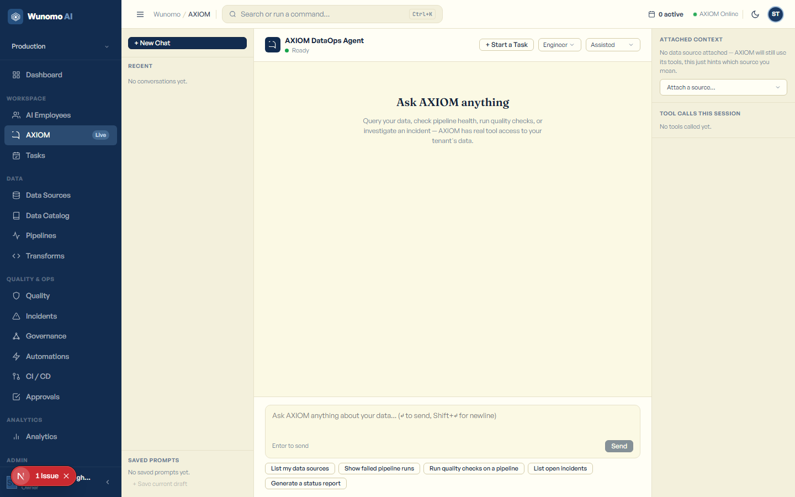
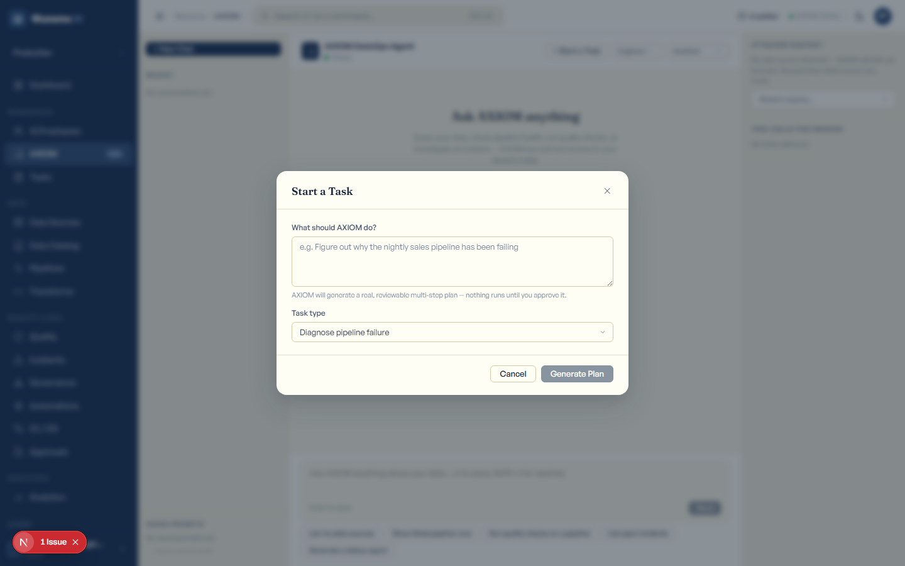
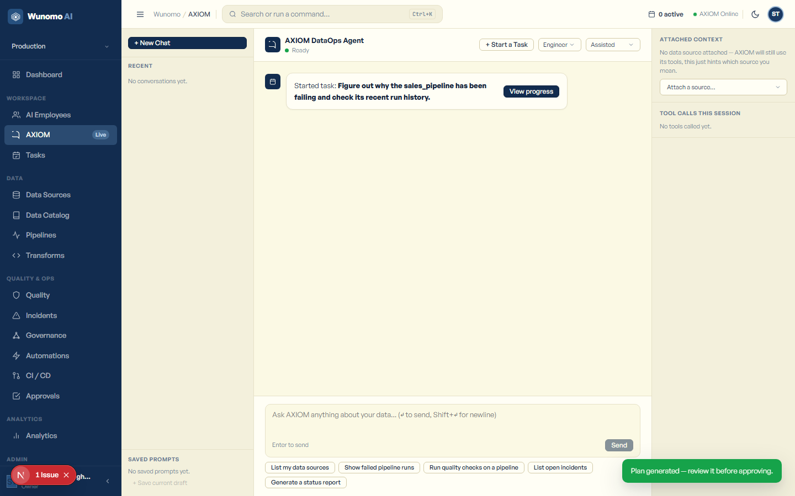
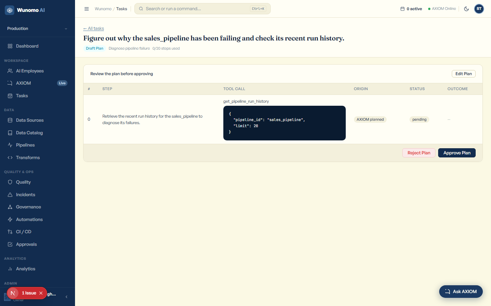
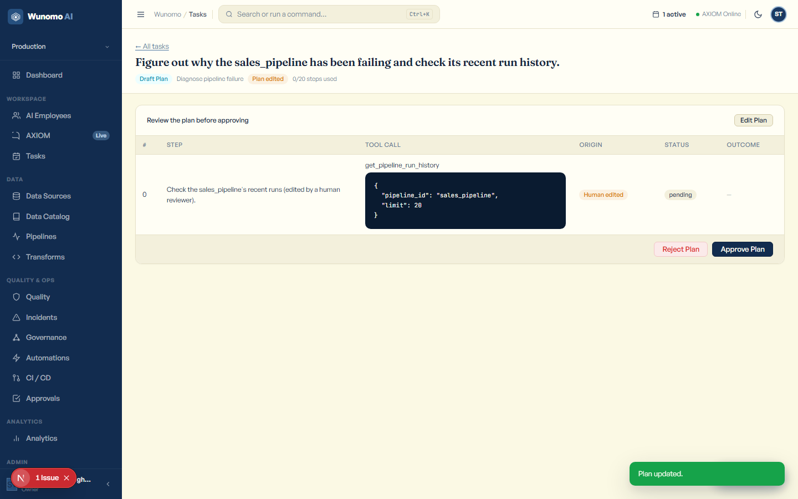
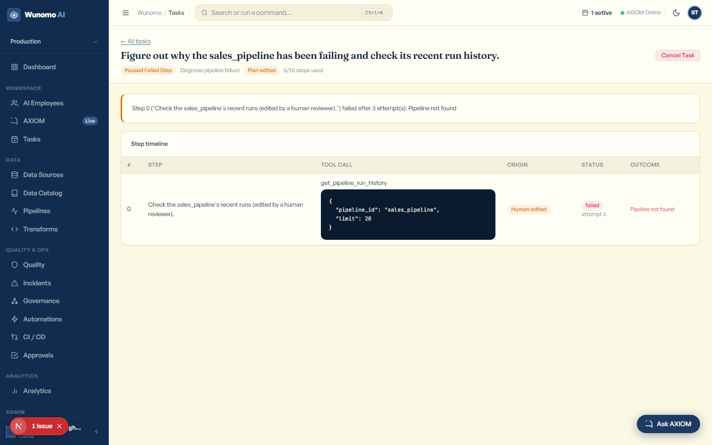
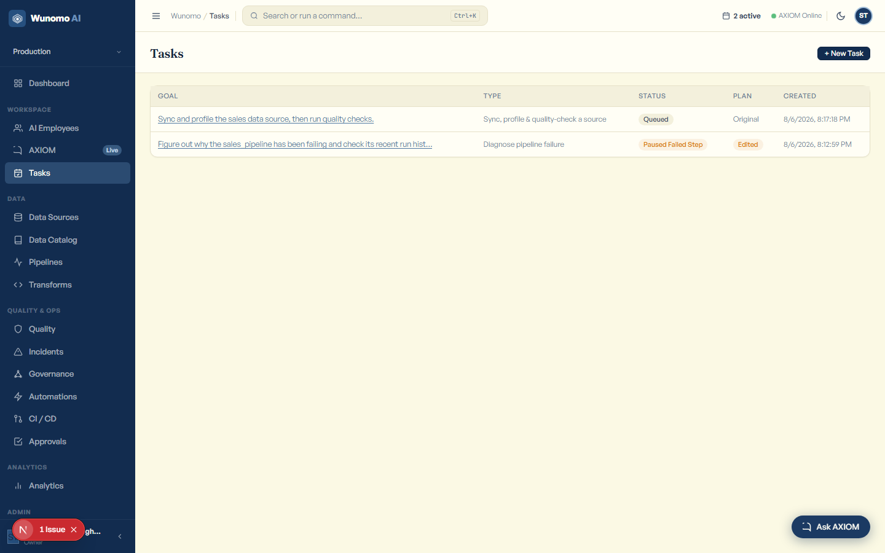
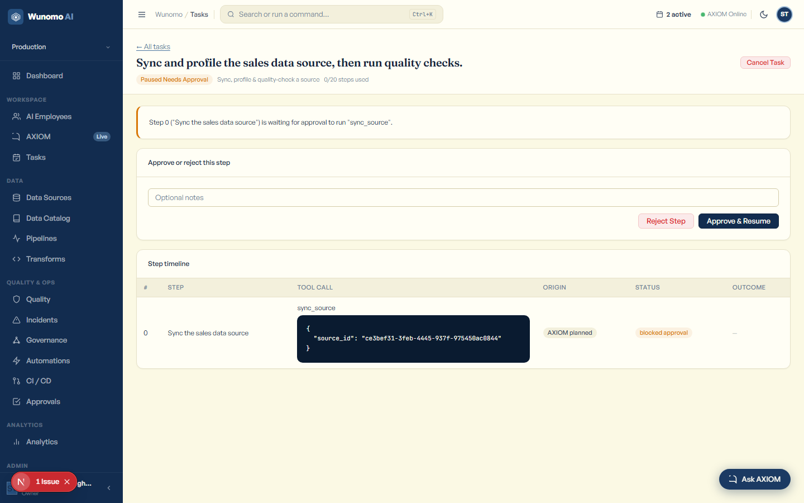
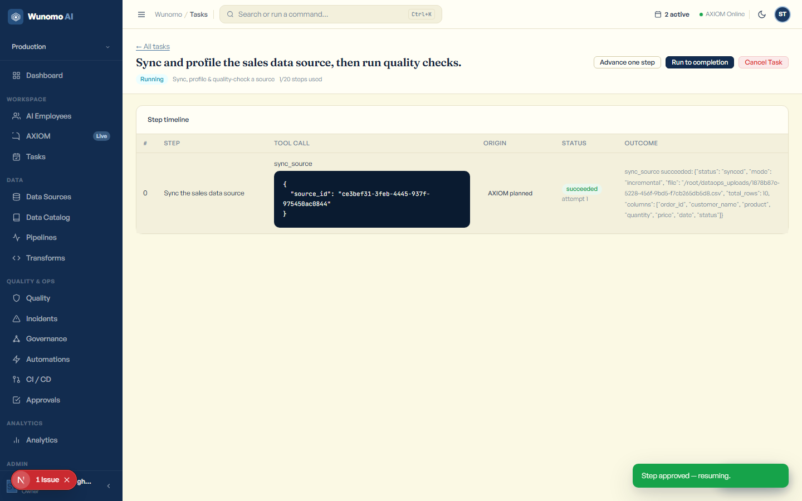

# AXIOM Self-Test Guide — Try The Whole Product Yourself

This assumes you've never clicked through this product end to end, and
specifically that you've **never used the Tasks feature** — every click,
every field, every button label is spelled out exactly as it appears on
screen. If a step says "click **+ New Pipeline**," that's the literal text
you're looking for.

Work through the sections in order: **1. Pre-flight** gets everything
running, **2. Setup** gets one real file of data into the product, **3. The
full flow** is the main walkthrough (source → pipeline → quality rule →
the Tasks feature, start to finish), **4. What to try breaking** is a short
list of things worth deliberately doing wrong, and **5. LLM budget** tells
you what each part actually costs so you don't run out of AI calls halfway
through.

---

## 1. PRE-FLIGHT — start everything and confirm it's healthy

### 1.1 Start Docker

Open a terminal (PowerShell — click the Windows Start button, type
`powershell`, press Enter) and run:

```
cd "C:\Pratyaksh Personal\My Projects\ai workforce\dataops-agent"
docker compose ps
```

**What you should see:** a table listing 5 rows — `dataops_backend`,
`dataops_beat`, `dataops_celery`, `dataops_postgres`, `dataops_redis` —
each with a `STATUS` column saying **`Up ...`**.

**If the table is empty, or any row doesn't say `Up`:**
```
docker compose up -d
```
Wait about 15 seconds, then run `docker compose ps` again and confirm all
5 rows say `Up`.

### 1.2 Confirm the backend is actually healthy (not just "the container started")

A container can say `Up` while the app inside it is still crashing. Check
the real thing:

```
curl http://localhost:8000/health
```
**Good result:** `{"status":"ok","env":"development","version":"1.0.0"}`

```
curl http://localhost:8000/health/db
```
**Good result:** `{"status":"ok","db":"connected"}`

**If either one fails to connect at all:** the backend container isn't
actually up yet — wait 10 more seconds and try again. **If `/health/db`
returns an error body** (not a connection failure, an actual error
message): Postgres isn't reachable — run `docker compose ps` again and
confirm `dataops_postgres` says `Up`.

### 1.3 Start the frontend

The frontend is *not* one of the Docker containers — you run it yourself,
in its own terminal window that has to stay open:

```
cd "C:\Pratyaksh Personal\My Projects\ai workforce\dataops-agent\frontend"
npm run dev
```

**What you should see:** after a few seconds, a line saying `Ready in
...ms`, and the window stays open (don't close it — closing it stops the
site). Leave this terminal running for your whole session.

Now open a browser and go to **http://localhost:3000**. You should land on
a login page. If the browser can't connect at all, the frontend isn't
actually up yet — check the terminal for a red error instead of `Ready`.

### 1.4 Which login to use

You have two options. **For this guide, use option A** — it gives you a
completely clean, empty account you fully control, which is what the rest
of this guide assumes.

**Option A — Sign up fresh (recommended for this guide).** On the login
page, click **Sign up** (a link near the bottom of the form). You'll fill
in your own email/password in step 3.1 below — don't do it yet, just
confirm the page loads.

**Option B — Use the pre-built demo account**, if you just want to look
around without setting anything up yourself:
- Email: `demo@axiom-yc.ai`
- Password: `AxiomDemo2026!`

This account already has a real source, a real pipeline with real run
history, and one real open incident — but it has **no Tasks data**, since
the Tasks feature didn't exist when this demo account was built. If you
use this login, you can skip straight to the Tasks part of Section 3
(3.9 onward), since the source/pipeline/quality-rule setup is already
done for you.

### 1.5 How to reset the demo account back to its known-good state

If you (or anyone else) has been clicking around in the demo account and
you want it back to exactly its original state:

```
cd "C:\Pratyaksh Personal\My Projects\ai workforce"
node dataops-agent/scripts/demo_reset.mjs
```

This takes 15–30 seconds and is safe to re-run any number of times — it
always rebuilds the same fixed state (one healthy pipeline, one broken
pipeline with one real open incident about it). It does **not** touch
your own fresh-signup account from Option A — that's a separate,
independent tenant. If you want to start *your own* account over, the
simplest way is just to sign up again with a new email — every signup
creates a brand new, empty account with nothing shared between accounts.

### 1.6 Check your AI quota before you spend any of it

This product uses two real AI providers (Google Gemini and Groq/Llama).
Both have a real daily limit, and this project's Gemini key is capped at
roughly **20 real requests per day** — not a lot. Section 5 below has the
full cost breakdown; this step is just about checking where you stand
*before* you start.

**Free check (costs nothing, just looks at what's already happened
today):**
```
docker exec dataops_postgres psql -U dataops_user -d dataops -c "SELECT provider, count(*) AS calls_today FROM llm_usage_events WHERE created_at >= CURRENT_DATE GROUP BY provider;"
```
This shows how many real AI calls have already happened today, split by
provider. If you see `gemini` already sitting near 20, expect it to fall
back to the other provider (Groq) automatically — the product handles
that on its own, you don't need to do anything.

**Optional live probe (costs exactly 1 real call, confirms the AI is
actually responding right now, not just that quota exists):**
```
node "C:\Pratyaksh Personal\My Projects\ai workforce\dataops-agent\scripts\demo_chat_test.mjs" "Say OK."
```
**Good result:** a line saying `status: 200`, a `provider:` name, and a
real reply from AXIOM within about 10 seconds. **Bad result:** `status:
500`, or it hangs for 30+ seconds. That means both providers are
temporarily unavailable — wait 15 minutes and try again; it's not
something you broke.

---

## 2. SETUP — get one real file of data into the product

### 2.1 The sample file

Save this as `sales_data.csv` anywhere on your computer (Desktop is fine —
you'll pick it from a file browser in a moment). This exact file already
exists at the root of this project too, at
`C:\Pratyaksh Personal\My Projects\ai workforce\sales_data.csv`, so you
can use that one directly instead of retyping it if you'd rather.

```csv
order_id,customer_name,product,quantity,price,date,status
1001,Rahul Sharma,Laptop,2,45000,2024-01-15,completed
1002,Priya Singh,Mouse,5,800,2024-01-16,completed
1003,Amit Kumar,Keyboard,3,1500,2024-01-16,pending
1004,Sneha Patel,Monitor,1,12000,2024-01-17,completed
1005,Raj Verma,Laptop,1,45000,2024-01-17,cancelled
1006,Deepa Nair,Headphones,4,2500,2024-01-18,completed
1007,Vikram Joshi,Mouse,2,800,2024-01-18,pending
1008,,Keyboard,1,1500,2024-01-19,completed
1009,Anita Desai,Monitor,2,12000,2024-01-19,completed
1010,Karan Mehta,Laptop,1,45000,2024-01-20,completed
```

Notice row `1008` has a **blank customer name** — that's deliberate. You'll
use it later to see a quality check genuinely catch something real,
instead of a check that just always passes and proves nothing.

### 2.2 Upload it as a Data Source

1. In the left sidebar, under the **DATA** section, click **Data Sources**.
2. Click **+ Add Source** (top right).
3. A window titled **Add Data Source** opens. The **Type** dropdown
   already says **CSV file** — leave it as is.
4. Click the **File** field and pick `sales_data.csv` from your computer.
5. A **Name** field appears, pre-filled with the filename. Clear it and
   type: `Sales Orders`
6. Click **Upload & Create** (bottom right of the window).

**What you should see:** a green success message near the bottom of the
screen, the window closes, and a new row appears in the table: **Sales
Orders**, type `csv`, status **Active**, and a **Last Profiled** column
that says **Never**.

### 2.3 Confirm it actually profiled — this is the step people miss

Uploading a file registers it, but it does **not** automatically read its
column structure — you have to ask it to, once, per source.

1. On the **Sales Orders** row, click **Profile**.
2. Wait a couple of seconds.

**What you should see:** a green "Source profiled" message, and the
**Last Profiled** column now shows a real date/time instead of "Never."

**If it looks wrong** (still says "Never" after clicking Profile, or an
error toast appears): click **Profile** again — this action is safe to
repeat. If it keeps failing, re-check Section 1.2 (backend health) — a
profile failure almost always means the backend lost its connection to
the uploaded file, which usually means Docker was restarted without the
upload volume attached.

*(Optional double-check: click* **Data Catalog** *in the sidebar — you
should see* **Sales Orders** *listed with 7 real columns:* `order_id`,
`customer_name`, `product`, `quantity`, `price`, `date`, `status`*.)*

---

## 3. THE FULL FLOW — one numbered step per click

### Part A — Source → Pipeline → Run

**3.1** *(Skip this if you're using the demo login from 1.4B.)* If you
haven't signed up yet: on the login page, click **Sign up**. Fill in:
- **Full name**: anything, e.g. `Test User`
- **Email**: any email you haven't used before, e.g. `test1@example.com`
- **Workspace name**: anything, e.g. `My Test Company`
- **Password**: anything 8+ characters

Click **Create account**.

**What you should see:** a short 4-step onboarding wizard (pick anything
in each step — role, industry, company size, use cases — none of it
affects this test). Click through it with **Next**, then **Finish** on
the last step. You land on the **Dashboard**.

**3.2** If you already did Section 2 (uploaded Sales Orders), skip ahead
to 3.3. Otherwise, go do Section 2 now, then come back here.

**3.3** In the left sidebar, click **Pipelines**.

**3.4** Click **+ New Pipeline** (top right).

**3.5** In the window that opens:
- **Name**: type `Sales Ingestion Pipeline`
- **Source**: open the dropdown and pick **Sales Orders**
- **Description**: type `Pulls in sales orders` (optional, but type it
  anyway so you can see the field work)
- **Schedule (cron, optional)**: leave blank — you'll run it manually

Click **Create**.

**What you should see:** the window closes, a green success message
appears, and **Sales Ingestion Pipeline** appears in the table with status
**draft** and "Never run" under Next/Last Run.

**3.6** On that row, click **Trigger**.

**What you should see:** a "Run triggered" message. Within a couple of
seconds (refresh isn't automatic here — click **Trigger** once and wait,
or click the pipeline's name to check), the row's **Next / Last Run**
column should show **Last: success** in a green badge.

**If it shows a red "failed" badge instead:** click the pipeline's own
**name** (it's a clickable link) — a window titled **Runs — Sales
Ingestion Pipeline** opens showing every run with a real error message.
The most common cause at this stage is the file upload not being visible
to the pipeline worker — re-check that Section 2.3's Profile step
actually succeeded.

**3.7** Click the pipeline's name (**Sales Ingestion Pipeline**) to open
its run history.

**What you should see:** a window listing at least one run, status
**success**, with a real row count (10 — matching the 10 data rows in the
CSV) and a real duration in milliseconds. Close the window (click outside
it or the X).

### Part B — A quality rule that actually catches something

**3.8** In the left sidebar, click **Quality**.

**3.9** Click **+ New Rule**.

**3.10** In the window:
- **Name**: `No missing customer name`
- **Pipeline**: pick **Sales Ingestion Pipeline**
- **Rule type**: leave it on **not_null** (the first option)
- **Column (optional)**: type `customer_name`
- **Severity**: leave on the default

Click **Create**.

**3.11** On the new rule's row, click **Run Checks**.

**What you should see:** a message like "Checks ran — score ..., X
passed / 1 failed." — the **1 failed** is real: it's catching row 1008's
blank customer name. The **Pass / Fail** column on that row should now
show real numbers, not `0 / 0`.

*(One thing worth knowing: "Run Checks" re-runs* **every** *quality rule
attached to that pipeline, not just the one you clicked it on — if you
add more rules later, all of them run together.)*

### Part C — The Tasks feature (this is the new part)

This is where AXIOM actually plans and does multi-step work on its own,
with you reviewing and approving each risky step before it happens.
Nothing you've done so far in this guide used AXIOM's AI at all — this is
the first part that spends real AI calls (see Section 5 for exact costs).

**3.12** In the left sidebar, under **WORKSPACE**, click **AXIOM** (it has
a **Live** badge next to it). This opens the chat screen.



**3.13** In the top right of the chat panel, click **+ Start a Task**.

**What you should see:** a window titled **Start a Task** opens, with a
text box labeled **"What should AXIOM do?"** and a dropdown labeled
**"Task type."**



**3.14** In the text box, type exactly:
```
Check the health and recent run history of my Sales Ingestion Pipeline.
```

**3.15** Leave the **Task type** dropdown on its default value,
**"Diagnose pipeline failure."**

**3.16** Click **Generate Plan** (bottom right).

**What you should see:** the button changes to "Generating plan…" for a
few seconds (this is a real AI call happening) — then a green "Plan
generated — review it before approving" message, and a new card appears
right in the chat: **"Started task: Check the health and recent run
history of my Sales Ingestion Pipeline."** with a **View progress**
button.



**If nothing happens after 30+ seconds, or you see a red error message:**
the AI provider is likely temporarily unavailable — this is the same
"bad result" case from the 1.6 quota check. Wait a few minutes and try
again with the **+ Start a Task** button; nothing was created (check the
**Tasks** page — it should be empty if this happened).

**3.17** Click **View progress** on that card.

**What you should see:** you're taken to a new page. At the top: the goal
you typed as the title, a light-blue **Draft Plan** badge, and a real
step-by-step plan in a table — showing exactly which tool AXIOM plans to
call and with what arguments (this is real, not a guess — it's what will
actually run if you approve it).



*Your exact plan might have a different number of steps than the
screenshot — that's normal, AXIOM generates it fresh from a real AI call
each time.*

**3.18** Now let's edit a step, to see AXIOM tell the difference between
what it planned and what a human changed. Click **Edit Plan** (top right
of the plan card).

**3.19** The first step's description becomes an editable text box. Click
into it, clear it, and type:
```
Check the pipeline's recent runs (edited by a human reviewer).
```

**3.20** Click **Save Changes**.

**What you should see:** a "Plan updated." message, the task-level badge
row now shows an extra orange **Plan edited** badge, and — the important
part — the step's **Origin** column, which said gray **"AXIOM planned"**
before, now says orange **"Human edited."**



**3.21** Click **Approve Plan** (bottom right of the card).

**What you should see:** the status badge flips from **Draft Plan** to
**Queued**, the Edit/Approve/Reject buttons disappear, and two new
buttons appear at the top right: **Advance one step** and **Run to
completion**.

**3.22** Click **Run to completion**.

**What you should see:** the button changes to "Running…" and the step
timeline below updates live as each step actually runs. Wait for it to
settle (a few seconds per step). It will land on one of these real, valid
outcomes — **all of these are correct, normal results**, not bugs:

- **Completed** (green badge) — every step succeeded. The step timeline
  shows a green "succeeded" status and a real outcome summary for each
  one.
- **Paused Failed Step** (orange badge) — a step tried something (like
  looking up the pipeline by the exact name AXIOM guessed) and it didn't
  resolve after 3 real attempts. A banner at the top will name the exact
  step and the exact error — read it, it's specific, not generic.

Either way, the **step_budget** counter near the top ("N/20 steps used")
should have gone up from `0/20`, and the top-right topbar's "N active"
counter (next to the calendar icon) should reflect it.



**3.23** Click **← All tasks** (top left) to go back to the list.

**What you should see:** a table with the one task you just ran, showing
its real final status, whether the plan was edited, and when it was
created.



### Part D — Hitting an approval gate (AXIOM asking permission)

Some actions are riskier than just *looking at* things — syncing a real
data source, for example. AXIOM is required to pause and ask a human
before doing those, no matter what. Let's trigger that on purpose.

**3.24** Go back to **AXIOM** in the sidebar, click **+ Start a Task**
again.

**3.25** In the text box, type:
```
Sync and profile my Sales Orders source, then run quality checks on it.
```

**3.26** Open the **Task type** dropdown and pick **"Sync, profile &
quality-check a source."**

**3.27** Click **Generate Plan**, then click **View progress** on the new
chat card, same as before.

**3.28** Review the plan (same as 3.17 — no need to edit this one), then
click **Approve Plan**.

**3.29** Click **Run to completion**.

**What you should see:** it runs for a moment, then **stops itself** with
a new status badge: **Paused Needs Approval**. A banner explains exactly
which step is waiting and which real action it wants to run (something
like `sync_source`). Below that, a card titled **"Approve or reject this
step"** appears, with an optional notes field and two buttons: **Reject
Step** and **Approve & Resume**.



**3.30** Click **Approve & Resume**.

**What you should see:** a "Step approved — resuming." message. The
status flips back to **Running**, and the step's row in the timeline now
shows **succeeded** with a real outcome (e.g. real row counts from the
sync). The **Advance one step** / **Run to completion** buttons come back.



**3.31** Click **Run to completion** again.

**What you should see:** this plan has more than one step that needs
approval (`sync_source`, `profile_schema`, and `run_quality_checks` are
all in this "riskier" category) — so it will likely **pause again**,
asking for approval a second (or third) time. That's expected, not a
bug. **Repeat step 3.30** (click **Approve & Resume**) each time it
pauses, until it reaches a final state (Completed, Completed With
Unconfirmed Steps, or Paused Failed Step). Every pause is real — you're
approving one genuinely new action each time, not clicking through the
same thing twice.

You've now seen the entire arc the Tasks feature is built around: a real
plan, a human edit, approval, real execution, a real safety stop, and a
real resume.

---

## 4. WHAT TO TRY BREAKING

These are things a real user does by accident (or on purpose) that are
worth deliberately testing. None of these should crash the app or show a
blank white screen — if any of them do, that's a real bug worth writing
down.

### 4.1 Start a task with a vague, useless goal

Click **+ Start a Task**, type just: `help` — leave the type on
**"Diagnose pipeline failure"** — click **Generate Plan**.

**Two valid outcomes**, both fine:
- A red error message appears saying it couldn't generate a valid plan.
  Check the **Tasks** list — nothing new should be there (a failed
  generation never creates a task).
- AXIOM generates *some* real plan anyway, even though your goal was
  vague — AI models generally try their best rather than refusing. If
  this happens, open it and just click **Reject Plan** (see 4.2) instead
  of approving something you didn't really want.

### 4.2 Reject a plan

Start any small task (e.g. type `Check system health` with type
**"Diagnose pipeline failure"**). On the plan review screen, click
**Reject Plan** (red button, bottom right — it fires immediately, no
"are you sure" prompt).

**What you should see:** a message: "Plan rejected. Start a new task to
try again." The status badge changes to **Plan Rejected**, and there are
no more action buttons on the page — it's a dead end by design. You'd
need to start a brand new task to try again, which the message tells you
directly.

### 4.3 Cancel a task mid-run

Start a task, approve its plan (so it's in **Queued** or **Running**
status), then — before it finishes — click **Cancel Task** (top right,
red button, visible whenever a task isn't already finished).

**What you should see:** the status flips to **Cancelled**, and a banner
explains who cancelled it. If a step happened to be actively running at
that exact moment, the banner will say so honestly — it can't interrupt a
step that's already mid-flight, but it guarantees the task's overall
status stays **Cancelled** no matter what that step ends up doing.

### 4.4 Run a task as a Viewer (the interesting one)

This tests something specific: **a Viewer can create and approve a task
plan just fine — the block only happens when a step actually tries to
run**, because AXIOM re-checks your real permissions right before each
action, not just once at the start.

**Set up a Viewer account** (only needs doing once):
1. In the sidebar, under **ADMIN**, click **Team**.
2. Click **+ Invite Member**.
3. **Email**: type anything, e.g. `viewer-test@example.com` (it doesn't
   need to be a real, reachable email — you'll use the link directly).
4. **Role**: open the dropdown and pick **Viewer**.
5. Click **Send Invite**.
6. **Important — copy this now, you only get to see it once:** a box
   appears with a real link starting with
   `http://localhost:3000/invite/accept?token=...`. Select all of it and
   copy it before doing anything else. Click **Done** only after you've
   copied it.

**Accept the invite as the Viewer** — **use a Private/Incognito browser
window for this part** (Ctrl+Shift+N in Chrome/Edge), not just a new tab.
Using a regular new tab will log you out of your own account, because
both tabs share the same login storage.
1. In the Incognito window, paste the invite link and press Enter.
2. You'll see "You've been invited to join ... as viewer." The **Email**
   field is locked to what you typed. Type a **Full name** (optional) and
   a **Password**.
3. Click **Accept invite & join**.

**Now, still in that Incognito window, as the Viewer:**
1. Click **AXIOM** in the sidebar → **+ Start a Task**.
2. Type: `Sync and profile my Sales Orders source, then run quality checks on it.`
3. Pick task type **"Sync, profile & quality-check a source."**
4. Click **Generate Plan**, then **View progress**.

**What you should see:** this all works completely normally — a Viewer
can create a plan, edit it, and approve it, exactly like before.

5. Click **Approve Plan**, then **Run to completion**.

**What you should see now — the real point of this test:** the first
step that tries to actually *do* something (like `sync_source`) fails
immediately, landing on **Paused Failed Step**. The banner will say
something like *"Blocked: the initiating user's role ('viewer') no
longer has permission to use 'sync_source'."* — a real, specific
permission block, caught at the moment of execution, not before. This is
intentional: **creating and approving a plan is always allowed; running
it is checked fresh, every single step.**

---

## 5. LLM BUDGET — what costs a real AI call, and what doesn't

Two things drive real cost in this product: **sending a chat message**,
and **generating a task plan**. Almost everything else — approving,
editing, cancelling, viewing — is free (a plain database action, no AI
involved).

| Action | Real AI calls it costs |
|---|---|
| Uploading/profiling a source | 0 |
| Creating/triggering a pipeline | 0 |
| Creating/running a quality rule | 0 |
| Sending one message in AXIOM chat | **1** |
| Clicking "Generate Plan" for a new task | **1** |
| Editing a plan's steps | 0 |
| Approving or rejecting a plan | 0 |
| Advance one step / Run to completion | 0, **unless** a step hits a real error (e.g. "not found") — then **1 extra call** for that one step, to try correcting itself. Capped at 1 extra call per step, no matter how many of its 3 retry attempts happen. |
| Approve & Resume on a paused step | 0 — confirmed: resuming a step never calls the AI at all |
| Cancelling a task | 0 |

**What following this entire guide costs, realistically:** 2 real calls
(one per task you start in Part C/D) — possibly 1–2 more if a step hits
an error and needs to self-correct, and 1 more if you do the "vague goal"
test in Section 4.1. **Roughly 3–5 real calls total for the whole guide,
start to finish.** That comfortably fits inside a fresh day's ~20-call
Gemini budget even before Groq (the second provider, with a much larger
shared daily pool) ever needs to kick in as backup.

**If you do run out:** the product automatically switches to the second
AI provider (Groq) on its own — you don't have to do anything, and you
won't necessarily notice, since both produce real answers. You can see
which one handled any given task by checking the real `provider` field —
the chat screen shows "Ready · last reply via gemini" (or `groq`) right
under AXIOM's name at the top of the chat panel. If *both* providers are
exhausted at the same time (rare, but possible on a busy day), you'll see
a clear inline error message in the chat instead of a hang or a crash —
wait a while and try again.
